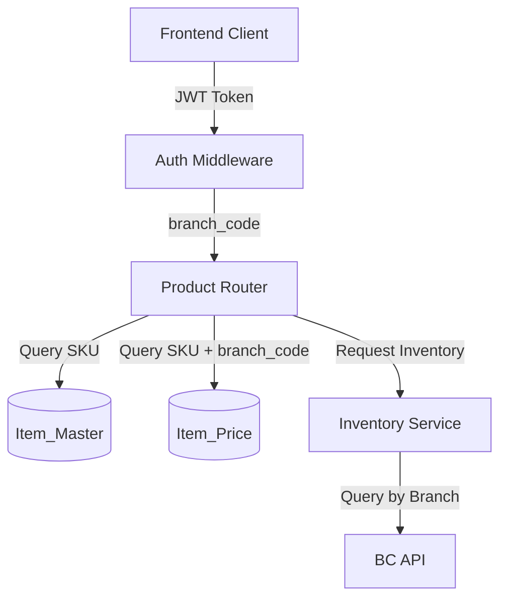

# Design Document: Branch-Based Product Filtering

## Overview

This design migrates the product data source from the legacy Items_Test table to the normalized Item_Master + Item_Price tables with branch-based filtering. The migration ensures that employees only see products, prices, and inventory relevant to their branch location.

The system will:
- Extract branch_code from JWT tokens via authentication middleware
- Query Item_Master for core product data and LEFT JOIN with Item_Price filtered by branch
- Fetch branch-specific inventory from BC API via the existing Inventory Service
- Maintain backward compatibility with existing API response formats
- Support gradual migration via feature flags

## Architecture

### High-Level Architecture



### Data Flow

1. **Request Flow**:
   - Client sends request with JWT token in Authorization header
   - Auth Middleware extracts and validates JWT token
   - Auth Middleware extracts branch_code from token claims
   - Product Router receives request with branch_code context
   - Product Router queries Item_Master + Item_Price (filtered by branch_code)
   - Product Router calls Inventory Service for branch-specific inventory
   - Product Router returns unified response

2. **Feature Flag Flow**:
   - Product Router checks USE_NEW_ITEM_TABLES environment variable
   - If True: Use Item_Master + Item_Price
   - If False: Use Items_Test (legacy)
   - Log which data source is used

### Migration Strategy

The migration will be gradual:
- Phase 1: Implement Auth Middleware and branch extraction
- Phase 2: Create data access layer with feature flag support
- Phase 3: Migrate individual endpoints one category at a time
- Phase 4: Test with feature flag enabled for specific branches
- Phase 5: Enable globally and deprecate Items_Test

## Components and Interfaces

### 1. Auth Middleware

**Purpose**: Extract and validate JWT tokens, make branch_code available to route handlers.

**Location**: `backend/middleware/auth.py`

**Interface**:
```python
from fastapi import Request, HTTPException
from typing import Optional
import jwt
import os

JWT_SECRET = os.getenv("JWT_SECRET", "dev-secret-change-this")
JWT_ALG = "HS256"

class AuthContext:
    """Context object containing authenticated user information"""
    employee_id: str
    employee_name: str
    branch_code: str

def get_auth_context(request: Request) -> AuthContext:
    """
    Extract and validate JWT token from request.
    
    Returns:
        AuthContext with employee_id, employee_name, branch_code
    
    Raises:
        HTTPException 401: If token is missing or invalid
        HTTPException 400: If branch_code is missing from token
    """
    pass

def validate_branch_code(branch_code: str) -> bool:
    """
    Validate that branch_code exists in Branch table.
    
    Args:
        branch_code: Branch code to validate
    
    Returns:
        True if valid, False otherwise
    """
    pass
```

**Behavior**:
- Extract Authorization header
- Decode JWT token using JWT_SECRET
- Validate token signature and expiration
- Extract claims: sub (employee_id), name (employee_name), branchId (branch_code)
- Validate branch_code exists in Branch table
- Return AuthContext object
- Raise HTTPException on validation failures

### 2. Product Data Access Layer

**Purpose**: Abstract data source (Items_Test vs Item_Master + Item_Price) behind a unified interface.

**Location**: `backend/services/product_data_service.py`

**Interface**:
```python
from typing import Optional, List
import pandas as pd
from dataclasses import dataclass

@dataclass
class ProductData:
    """Unified product data structure"""
    sku: str
    sku2: Optional[str]
    name: str
    category: str
    product_group: str
    product_sub_group: str
    unit: str
    pkg_size: float
    is_variant: bool
    alternate_names: Optional[str]
    
    # Prices (branch-specific)
    price_r1: Optional[float]
    price_r2: Optional[float]
    price_w1: Optional[float]
    price_w2: Optional[float]
    price_sdm: Optional[float]
    cost: float
    price_updated_at: Optional[str]
    
    # Inventory (branch-specific)
    inventory: float

class ProductDataService:
    """Service for loading product data from either legacy or new tables"""
    
    def __init__(self, use_new_tables: bool = None):
        """
        Initialize service with data source selection.
        
        Args:
            use_new_tables: If True, use Item_Master + Item_Price.
                          If False, use Items_Test.
                          If None, read from environment variable.
        """
        pass
    
    def load_products_by_category(
        self, 
        category: str, 
        branch_code: str
    ) -> List[ProductData]:
        """Load all products in a category for a specific branch"""
        pass
    
    def load_products_by_prefix(
        self, 
        prefix: str, 
        branch_code: str
    ) -> pd.DataFrame:
        """Load products by SKU prefix (for category-specific endpoints)"""
        pass
    
    def search_products(
        self, 
        query: str, 
        branch_code: str, 
        limit: int = 50
    ) -> List[ProductData]:
        """Full-text search across products"""
        pass
    
    def get_product_by_sku(
        self, 
        sku: str, 
        branch_code: str
    ) -> Optional[ProductData]:
        """Get single product by SKU"""
        pass
```

**Implementation Details**:

**Legacy Mode (Items_Test)**:
- Query Items_Test table directly
- No branch filtering (return all data)
- Map columns: No. → sku, Description → name, etc.
- Extract prices from R1, R2, W1, W2 columns
- Use Inventory column (not branch-specific)

**New Mode (Item_Master + Item_Price)**:
```sql
SELECT 
    im.SKU,
    im.No_2,
    im.Description,
    im.Base_Unit_of_Measure,
    im.Inventory_Posting_Group,
    im.Product_Group,
    im.Product_Sub_Group,
    im.Variant_Mandatory,
    im.RE,
    ip.SDM,
    ip.R2,
    ip.R1,
    ip.W2,
    ip.W1,
    ip.PackageSize,
    ip.AlternateName,
    ip.UpdatedAt
FROM Item_Master im
LEFT JOIN Item_Price ip ON im.SKU = ip.SKU AND ip.BranchCode = ?
WHERE im.Inventory_Posting_Group = ?
```

**Column Mapping**:
- Item_Master.SKU → sku
- Item_Master.No_2 → sku2
- Item_Master.Description → name
- Item_Master.Inventory_Posting_Group → category
- Item_Master.Product_Group → product_group
- Item_Master.Product_Sub_Group → product_sub_group
- Item_Master.Base_Unit_of_Measure → unit
- Item_Master.Variant_Mandatory → is_variant
- Item_Master.RE → cost
- Item_Price.R1 → price_r1
- Item_Price.R2 → price_r2
- Item_Price.W1 → price_w1
- Item_Price.W2 → price_w2
- Item_Price.SDM → price_sdm
- Item_Price.PackageSize → pkg_size
- Item_Price.AlternateName → alternate_names
- Item_Price.UpdatedAt → price_updated_at

### 3. Inventory Service Integration

**Purpose**: Fetch branch-specific inventory from BC API.

**Location**: `backend/services/inventory_query_service.py` (already exists)

**Current Interface**:
```python
class InventoryQueryService:
    def get_inventory(self, sku: str) -> List[InventoryByBranch]:
        """
        Get inventory for a SKU across all branches.
        
        Returns:
            List of InventoryByBranch objects with branch and quantity
        """
        pass
```

**Integration Pattern**:
```python
# In Product Router
inventory_service = get_inventory_service()
inventory_list = inventory_service.get_inventory(sku)

# Filter by branch
branch_inventory = [
    inv for inv in inventory_list 
    if inv.branch == branch_code
]

# Sum quantities for the branch
total_inventory = sum(inv.quantity for inv in branch_inventory)
```

**Caching Strategy**:
- Inventory Service already implements caching with 5-minute TTL
- No changes needed to caching logic
- Cache key includes SKU (not branch), so one cache entry serves all branches

### 4. Product Router Modifications

**Purpose**: Update all product endpoints to use new data source and branch filtering.

**Location**: `backend/products_router.py`

**Endpoints to Migrate**:

1. **GET /items/categories/list**
   - Load all categories from Item_Master
   - No branch filtering needed (categories are global)

2. **GET /items/categories/{category_name}**
   - Load products by category
   - Filter prices by branch_code
   - Fetch branch-specific inventory

3. **GET /items/search**
   - Full-text search across Item_Master
   - Filter prices by branch_code
   - Return top 50 results

4. **GET /aluminium/master** and **GET /aluminium/options**
   - Load aluminium products (prefix "A")
   - Filter prices by branch_code
   - Return filter options (brands, groups, subgroups, colors, thickness)

5. **GET /aluminium/items**
   - Load aluminium products with filters
   - Filter prices by branch_code
   - Include branch-specific inventory

6. **GET /cline/master**, **GET /cline/options**, **GET /cline/items**
   - Same pattern as aluminium (prefix "C")

7. **GET /accessories/master**, **GET /accessories/options**, **GET /accessories/items**
   - Same pattern (prefix "E")

8. **GET /sealant/master**, **GET /sealant/options**, **GET /sealant/items**
   - Same pattern (prefix "S")

9. **GET /gypsum/master**, **GET /gypsum/options**, **GET /gypsum/items**
   - Same pattern (prefix "Y")

10. **GET /glass/list**, **GET /glass/filter-options**, **POST /glass/calc**
    - Glass endpoints (prefix "G")
    - Maintain existing caching strategy
    - Filter prices by branch_code

**Dependency Injection Pattern**:
```python
from fastapi import Depends
from middleware.auth import get_auth_context, AuthContext

@api_router.get("/items/categories/{category_name}")
def get_items_by_category(
    category_name: str,
    auth: AuthContext = Depends(get_auth_context)
):
    branch_code = auth.branch_code
    # Use branch_code to filter data
    ...
```

## Data Models

### Item_Master Table Schema

```sql
CREATE TABLE Item_Master (
    SKU VARCHAR(50) PRIMARY KEY,
    No_2 VARCHAR(50),
    Description VARCHAR(255),
    Base_Unit_of_Measure VARCHAR(20),
    Inventory_Posting_Group VARCHAR(50),
    Product_Group VARCHAR(50),
    Product_Sub_Group VARCHAR(50),
    Variant_Mandatory BIT,
    RE DECIMAL(18, 2),
    CreatedAt DATETIME
)
```

**Indexes**:
- PRIMARY KEY on SKU
- INDEX on Inventory_Posting_Group (for category filtering)
- INDEX on Product_Group (for filtering)
- INDEX on No_2 (for alternate SKU lookup)

### Item_Price Table Schema

```sql
CREATE TABLE Item_Price (
    SKU VARCHAR(50),
    BranchCode VARCHAR(10),
    SDM DECIMAL(18, 2),
    R2 DECIMAL(18, 2),
    R1 DECIMAL(18, 2),
    W2 DECIMAL(18, 2),
    W1 DECIMAL(18, 2),
    PackageSize DECIMAL(18, 4),
    AlternateName VARCHAR(255),
    UpdatedAt DATETIME,
    PRIMARY KEY (SKU, BranchCode)
)
```

**Indexes**:
- PRIMARY KEY on (SKU, BranchCode) - composite key
- INDEX on BranchCode (for branch-specific queries)

### JWT Token Claims

```json
{
  "sub": "EMP001",
  "name": "John Doe",
  "branchId": "BS",
  "exp": 1234567890
}
```

### API Response Format (Backward Compatible)

**Product Item Response**:
```json
{
  "sku": "A0101001010",
  "name": "Aluminium Profile",
  "inventory": 100,
  "unit": "PCS",
  "category": "ALUMINIUM",
  "isVariant": false,
  "prices": {
    "R1": 150.00,
    "R2": 140.00,
    "W1": 130.00,
    "W2": 120.00
  },
  "pkg_size": 1,
  "product_weight": 2.5,
  "product_group": "PROFILE",
  "product_sub_group": "STANDARD",
  "alternate_names": "ALU-PROFILE-001",
  "sku2": "ALT001"
}
```

**Category-Specific Response (Aluminium)**:
```json
{
  "sku": "A0101001010",
  "name": "Aluminium Profile",
  "brand": "01",
  "brandName": "Brand A",
  "group": "01",
  "groupName": "Profile",
  "subGroup": "001",
  "subGroupName": "Standard",
  "color": "01",
  "colorName": "Silver",
  "thickness": "01",
  "inventory": 100,
  "unit": "PCS",
  "product_group": "PROFILE",
  "product_sub_group": "STANDARD"
}
```


## Correctness Properties

A property is a characteristic or behavior that should hold true across all valid executions of a system—essentially, a formal statement about what the system should do. Properties serve as the bridge between human-readable specifications and machine-verifiable correctness guarantees.

### Property Reflection

After analyzing all acceptance criteria, I identified the following redundancies:
- Requirements 3.2, 3.3, 3.5 are redundant with other requirements (3.1, 2.3, 2.4)
- Requirements 6.1-6.4 are all covered by requirement 2.4 (response format compatibility)
- Requirements 5.5, 7.2, 8.2, 8.3, 9.2 are redundant with other requirements
- Many requirements are implementation details (SQL queries, logging) and not testable as properties

The following properties represent unique, testable behaviors:

### Property 1: JWT Token Extraction

*For any* valid HTTP request with an Authorization header containing a valid JWT token, extracting the token should return the token string without modification.

**Validates: Requirements 1.1**

### Property 2: Branch Code Extraction from JWT

*For any* valid JWT token containing a branchId claim, decoding the token should extract the branchId value correctly.

**Validates: Requirements 1.2**

### Property 3: Invalid Token Rejection

*For any* invalid JWT token (malformed, expired, or wrong signature), the Auth Middleware should return a 401 Unauthorized error.

**Validates: Requirements 1.3**

### Property 4: Branch Code Validation

*For any* branch_code extracted from a JWT token, if the branch_code exists in the Branch table, validation should succeed; otherwise, it should fail.

**Validates: Requirements 1.5**

### Property 5: Response Format Compatibility

*For any* product returned by the Product Router, the response should contain all required fields with the exact field names used by the legacy system (sku, name, category, priceR1, priceR2, priceW1, priceW2, inventory, etc.).

**Validates: Requirements 2.4, 2.5, 6.1, 6.2, 6.3, 6.4**

### Property 6: Branch-Specific Price Filtering

*For any* product with price records in multiple branches, when querying with a specific branch_code, the returned prices should match only that branch_code.

**Validates: Requirements 3.1**

### Property 7: Price UpdatedAt Inclusion

*For any* product with a price record, the response should include the UpdatedAt timestamp from the Item_Price table.

**Validates: Requirements 3.4**

### Property 8: Branch-Specific Inventory Aggregation

*For any* SKU with inventory across multiple branches, when aggregating inventory for a specific branch_code, the sum should include only quantities from that branch.

**Validates: Requirements 4.2**

### Property 9: Inventory Cache Effectiveness

*For any* SKU, when inventory is queried twice within the cache TTL period, the second query should not trigger an API call to BC_API.

**Validates: Requirements 4.4**

### Property 10: Inventory Cache Expiration

*For any* SKU, when inventory is queried after the cache TTL has expired, the query should trigger a fresh API call to BC_API.

**Validates: Requirements 4.5**

### Property 11: HTTP Status Code Consistency

*For any* error condition (invalid SKU, missing branch, etc.), the Product Router should return the same HTTP status code as the legacy system for that error type.

**Validates: Requirements 6.5**

### Property 12: Pagination Correctness

*For any* query with limit and offset parameters, the returned results should contain exactly `limit` items starting from position `offset` in the full result set.

**Validates: Requirements 7.4**

### Property 13: SKU Validation

*For any* product data being loaded, if the SKU field is empty or null, the Product Router should reject the record.

**Validates: Requirements 10.1**

### Property 14: Price Non-Negativity

*For any* price data being loaded, if any price field (R1, R2, W1, W2, SDM) is negative, the Product Router should reject the record.

**Validates: Requirements 10.2**

### Property 15: Inventory Quantity Validation

*For any* inventory data being loaded, if the quantity field is non-numeric, the Inventory Service should handle it gracefully (convert to 0 or skip).

**Validates: Requirements 10.3**

### Property 16: Invalid Record Skipping

*For any* batch of product data containing some invalid records, the Product Router should skip invalid records and process valid ones.

**Validates: Requirements 10.4**

### Property 17: Branch Code Pattern Validation

*For any* branch_code value, if it does not match the pattern [A-Z]{2,4}, the validation should fail.

**Validates: Requirements 10.5**

## Error Handling

### Error Categories

1. **Authentication Errors (401)**:
   - Missing Authorization header
   - Invalid JWT token (malformed, expired, wrong signature)
   - Token signature verification failure

2. **Authorization Errors (400)**:
   - Missing branchId claim in JWT token
   - Invalid branch_code (not in Branch table)
   - Invalid branch_code pattern

3. **Not Found Errors (404)**:
   - SKU not found in Item_Master
   - Category not found
   - Product not found

4. **Validation Errors (400)**:
   - Invalid query parameters
   - Invalid pagination parameters (negative offset, limit > 1000)
   - Empty or null SKU

5. **External Service Errors (503)**:
   - BC API unavailable
   - Database connection failure

### Error Response Format

All errors should follow the FastAPI HTTPException format:

```json
{
  "detail": "Descriptive error message"
}
```

### Graceful Degradation

1. **BC API Unavailable**:
   - Return empty inventory list
   - Log error with details
   - Continue processing other data

2. **Missing Price Data**:
   - Return product with null price fields
   - Do not fail the entire request

3. **Invalid Records in Batch**:
   - Skip invalid records
   - Log warnings
   - Process valid records

### Logging Strategy

1. **Info Level**:
   - Successful requests with branch_code
   - Data source selection (Items_Test vs Item_Master)
   - Cache hits/misses

2. **Warning Level**:
   - Invalid records skipped
   - Missing price data for branch
   - BC API errors (with graceful degradation)

3. **Error Level**:
   - Database connection failures
   - Authentication failures
   - Unhandled exceptions

## Testing Strategy

### Dual Testing Approach

This feature requires both unit tests and property-based tests:

**Unit Tests** focus on:
- Specific examples of JWT token extraction
- Edge cases (missing headers, malformed tokens)
- Integration between components
- Error conditions (404, 401, 400 responses)
- Feature flag behavior (enabled vs disabled)

**Property-Based Tests** focus on:
- Universal properties across all inputs
- Branch filtering correctness across random data
- Response format consistency across all products
- Validation rules across all input types
- Cache behavior across random access patterns

### Property-Based Testing Configuration

**Library**: Use `hypothesis` for Python property-based testing

**Configuration**:
- Minimum 100 iterations per property test
- Each test tagged with: `# Feature: branch-based-product-filtering, Property N: [property text]`
- Use custom generators for:
  - Valid/invalid JWT tokens
  - Valid/invalid branch codes
  - Product data with various field combinations
  - SKUs with different prefixes

**Example Property Test Structure**:
```python
from hypothesis import given, strategies as st
import pytest

# Feature: branch-based-product-filtering, Property 6: Branch-Specific Price Filtering
@given(
    sku=st.text(min_size=1, max_size=50),
    branch_code=st.text(min_size=2, max_size=4, alphabet=st.characters(whitelist_categories=('Lu',))),
    prices=st.dictionaries(
        keys=st.text(min_size=2, max_size=4),
        values=st.floats(min_value=0, max_value=10000)
    )
)
def test_branch_price_filtering(sku, branch_code, prices):
    # Setup: Insert product with prices for multiple branches
    # Action: Query product with specific branch_code
    # Assert: Returned prices match only the requested branch_code
    pass
```

### Test Coverage Goals

- Unit test coverage: 80% of code
- Property test coverage: 100% of correctness properties
- Integration test coverage: All API endpoints
- Error path coverage: All error conditions

### Testing Phases

**Phase 1: Component Testing**
- Test Auth Middleware in isolation
- Test Product Data Service with both data sources
- Test Inventory Service integration

**Phase 2: Integration Testing**
- Test full request flow (JWT → Auth → Router → Response)
- Test feature flag switching
- Test error propagation

**Phase 3: Migration Testing**
- Compare responses between Items_Test and Item_Master modes
- Verify response format compatibility
- Test with production-like data

**Phase 4: Performance Testing**
- Measure query performance with Item_Master + Item_Price
- Verify cache effectiveness
- Test with large result sets

