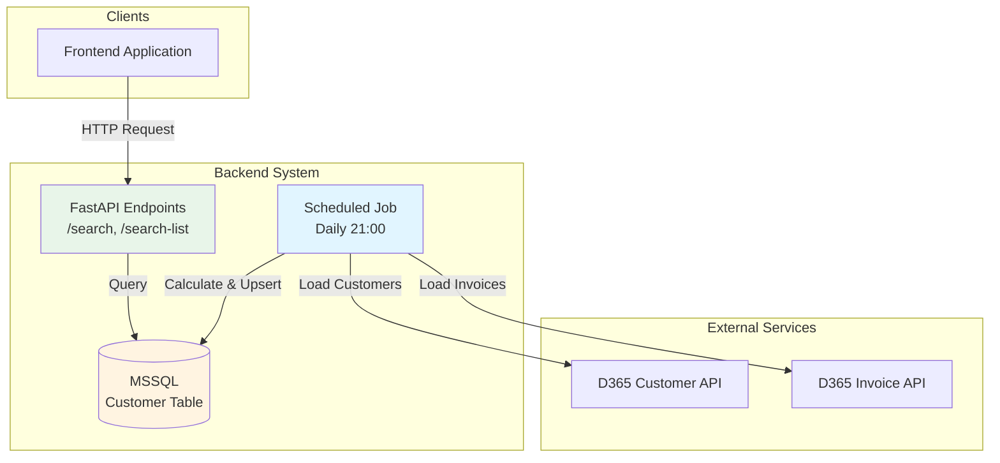

# Design Document: Customer Data Caching System

## Overview

The Customer Data Caching System transforms the current real-time API-based customer search into a database-backed caching layer. The system consists of three main components:

1. **Database Layer**: MSSQL table storing customer master data and pre-calculated analytics
2. **Scheduled Refresh Job**: Daily background process that loads data from D365 API and calculates analytics
3. **Modified Search Endpoints**: FastAPI endpoints that query the database instead of external APIs

The design maintains complete backward compatibility with the existing API contract while dramatically improving performance by eliminating 30,000+ API calls per search request.

## Architecture

### High-Level Architecture



### Data Flow

**Scheduled Job Flow (Daily at 21:00):**
1. Job starts, logs start time and calculation date
2. Load all customers from D365 API (paginated, 500 per page)
3. For each customer:
   - Load invoices from Invoice API (6-month lookback)
   - Calculate analytics (sales totals, frequency, category sales)
   - Upsert record into Customer_Table
4. Log completion statistics and errors

**Search Request Flow:**
1. Client sends search request (by code, phone, or name)
2. API endpoint queries Customer_Table with appropriate filters
3. Map database columns to API response format
4. Return results to client

## Components and Interfaces

### 1. Database Schema

**Table: Customer_Cache**

```sql
CREATE TABLE Customer_Cache (
    customer_code VARCHAR(50) PRIMARY KEY,
    customer_name NVARCHAR(255) NOT NULL,
    phone VARCHAR(50),
    tax_no VARCHAR(50),
    gen_bus VARCHAR(10),
    payment_terms VARCHAR(50),
    customer_date DATE,
    
    -- Analytics (6-month lookback)
    accum_6m DECIMAL(18, 2) DEFAULT 0,
    frequency INT DEFAULT 0,
    sales_g_cust DECIMAL(18, 2) DEFAULT 0,
    sales_a_cust DECIMAL(18, 2) DEFAULT 0,
    sales_s_cust DECIMAL(18, 2) DEFAULT 0,
    sales_y_cust DECIMAL(18, 2) DEFAULT 0,
    sales_c_cust DECIMAL(18, 2) DEFAULT 0,
    sales_e_cust DECIMAL(18, 2) DEFAULT 0,
    relevant_sales DECIMAL(18, 2) DEFAULT 0,
    price_level DECIMAL(18, 2) DEFAULT 0,
    
    -- Metadata
    last_updated DATETIME NOT NULL DEFAULT GETDATE(),
    calculation_date DATE NOT NULL,
    
    -- Indexes for search performance
    INDEX idx_customer_name (customer_name),
    INDEX idx_phone (phone),
    INDEX idx_last_updated (last_updated)
);
```

### 2. Scheduled Job Module

**File: `backend/jobs/customer_cache_refresh.py`**

**Key Functions:**

```python
def run_customer_cache_refresh():
    """
    Main entry point for the scheduled job.
    Orchestrates the entire refresh process.
    """
    # Log start time
    # Load customers from D365 API
    # Process each customer (load invoices, calculate analytics)
    # Batch upsert to database
    # Log completion statistics

def load_all_customers_from_d365() -> List[Dict]:
    """
    Load all customer records from D365 API using pagination.
    Returns list of customer dictionaries.
    """
    # Use existing CUSTOMER_API_URL and headers
    # Paginate with size=500
    # Handle timeouts and errors gracefully

def load_invoices_for_customer(customer_code: str, calculation_date: date) -> List[Dict]:
    """
    Load 6-month invoice history for a specific customer.
    
    Args:
        customer_code: Customer identifier
        calculation_date: Anchor date for 6-month lookback
    
    Returns:
        List of invoice dictionaries
    """
    # Calculate date range (calculation_date - 180 days to calculation_date)
    # Use existing INVOICE_API_URL and headers
    # Apply filters: customer_code, date range
    # Handle pagination and errors

def calculate_analytics(invoices: List[Dict]) -> Dict[str, float]:
    """
    Calculate all analytics from invoice data.
    
    Args:
        invoices: List of invoice records
    
    Returns:
        Dictionary with analytics fields
    """
    # Convert to DataFrame
    # Filter by date range
    # Calculate accum_6m (sum of Amount Including VAT)
    # Calculate frequency (unique Document No. count)
    # Classify SKUs by group (G, A, S, Y, C, E)
    # Calculate category sales
    # Calculate relevant_sales (max of category sales)
    # Set price_level = sales_e_cust

def upsert_customer_batch(customers: List[Dict], conn):
    """
    Batch upsert customer records to database.
    
    Args:
        customers: List of customer dictionaries with analytics
        conn: Database connection
    """
    # Use MERGE statement for upsert
    # Batch size: 100 records
    # Handle errors per batch

def classify_group(sku: str) -> str:
    """
    Classify SKU into group based on first character.
    Reuses existing logic from customer.py.
    """
    # Return first character uppercase
```

**Scheduler Configuration:**

```python
from apscheduler.schedulers.background import BackgroundScheduler
from apscheduler.triggers.cron import CronTrigger

scheduler = BackgroundScheduler()

# Run daily at 21:00
scheduler.add_job(
    run_customer_cache_refresh,
    trigger=CronTrigger(hour=21, minute=0),
    id='customer_cache_refresh',
    max_instances=1,  # Prevent concurrent runs
    replace_existing=True
)

scheduler.start()
```

### 3. Modified Search Endpoints

**File: `backend/customer.py` (modified)**

**Key Changes:**

```python
def search_customer_from_db(
    code: str | None = None,
    phone: str | None = None,
    name: str | None = None
) -> Dict:
    """
    Search customer from database table.
    Replaces load_customer_from_api() calls.
    """
    # Connect to MSSQL using get_mssql_conn()
    # Build WHERE clause based on parameters
    # Execute query
    # Map database columns to response format
    # Return customer data with analytics

def search_customer_list_from_db(query: str) -> List[Dict]:
    """
    Search customer list from database for autocomplete.
    Replaces load_customer_from_api() calls.
    """
    # Connect to MSSQL
    # Normalize phone query (remove non-digits)
    # Build WHERE clause with OR conditions:
    #   - customer_code LIKE query
    #   - customer_name LIKE query
    #   - phone matches normalized query
    # Limit to 15 results
    # Return list of customer summaries

# Modified endpoints
@router.get("/search")
@router.post("/search")
def search_customer(
    code: str | None = Query(None),
    phone: str | None = Query(None),
    name: str | None = Query(None),
):
    # Call search_customer_from_db() instead of load_customer_from_api()
    # Maintain exact same response format
    # Handle errors gracefully

@router.get("/search-list")
@router.post("/search-list")
def search_customer_list(q: str = Query(..., min_length=1)):
    # Call search_customer_list_from_db() instead of load_customer_from_api()
    # Maintain exact same response format
```

### 4. Configuration Module

**File: `backend/config/cache_config.py`**

```python
# Feature flag for rollback capability
USE_DATABASE_CACHE = True  # Set to False to use original API-based implementation

# Scheduler configuration
CACHE_REFRESH_HOUR = 21
CACHE_REFRESH_MINUTE = 0

# Job configuration
BATCH_SIZE = 100  # Records per database batch
API_PAGE_SIZE = 500  # Records per API page
API_TIMEOUT = 60  # Seconds
MAX_RETRIES = 3

# Logging configuration
LOG_FILE = "logs/customer_cache_refresh.log"
LOG_LEVEL = "INFO"
```

### 5. Logging Module

**File: `backend/jobs/cache_logger.py`**

```python
import logging
from logging.handlers import TimedRotatingFileHandler

def setup_cache_logger():
    """
    Configure logger for scheduled job with daily rotation.
    """
    logger = logging.getLogger('customer_cache')
    logger.setLevel(logging.INFO)
    
    handler = TimedRotatingFileHandler(
        'logs/customer_cache_refresh.log',
        when='midnight',
        interval=1,
        backupCount=30
    )
    
    formatter = logging.Formatter(
        '%(asctime)s - %(name)s - %(levelname)s - %(message)s'
    )
    handler.setFormatter(formatter)
    logger.addHandler(handler)
    
    return logger
```

## Data Models

### Customer Cache Record

```python
from dataclasses import dataclass
from datetime import date, datetime
from typing import Optional

@dataclass
class CustomerCacheRecord:
    """Represents a customer record in the cache table."""
    
    # Master data
    customer_code: str
    customer_name: str
    phone: Optional[str]
    tax_no: Optional[str]
    gen_bus: Optional[str]
    payment_terms: Optional[str]
    customer_date: Optional[date]
    
    # Analytics
    accum_6m: float
    frequency: int
    sales_g_cust: float
    sales_a_cust: float
    sales_s_cust: float
    sales_y_cust: float
    sales_c_cust: float
    sales_e_cust: float
    relevant_sales: float
    price_level: float
    
    # Metadata
    last_updated: datetime
    calculation_date: date
    
    def to_api_response(self) -> dict:
        """Convert to API response format for backward compatibility."""
        return {
            "id": self.customer_code,
            "name": self.customer_name,
            "tax_no": self.tax_no or "",
            "phone": self.phone or "",
            "gen_bus": self.gen_bus or "",
            "customer_date": str(self.customer_date) if self.customer_date else "",
            "payment_terms": self.payment_terms or "",
            "creditTerm": self.payment_terms or "",
            
            "accum_6m": self.accum_6m,
            "frequency": self.frequency,
            
            "sales_g_cust": self.sales_g_cust,
            "sales_a_cust": self.sales_a_cust,
            "sales_s_cust": self.sales_s_cust,
            "sales_y_cust": self.sales_y_cust,
            "sales_c_cust": self.sales_c_cust,
            "sales_e_cust": self.sales_e_cust,
            
            "sales_g": self.sales_g_cust,
            "sales_a": self.sales_a_cust,
            "sales_s": self.sales_s_cust,
            "sales_y": self.sales_y_cust,
            "sales_c": self.sales_c_cust,
            "sales_e": self.sales_e_cust,
            
            "price_level": self.price_level,
            "relevantSales": self.relevant_sales,
        }
```

### Job Execution Result

```python
@dataclass
class JobExecutionResult:
    """Tracks the result of a scheduled job execution."""
    
    start_time: datetime
    end_time: datetime
    calculation_date: date
    customers_processed: int
    customers_updated: int
    customers_failed: int
    errors: List[str]
    
    @property
    def duration_seconds(self) -> float:
        return (self.end_time - self.start_time).total_seconds()
    
    @property
    def avg_time_per_customer(self) -> float:
        if self.customers_processed == 0:
            return 0.0
        return self.duration_seconds / self.customers_processed
```

## Correctness Properties

*A property is a characteristic or behavior that should hold true across all valid executions of a system—essentially, a formal statement about what the system should do. Properties serve as the bridge between human-readable specifications and machine-verifiable correctness guarantees.*

### Prework Analysis

Let me analyze each acceptance criterion for testability:

**Requirement 1: Database Table Creation**
1.1 - Table creation with specific columns
  Thoughts: This is about database schema structure. We can verify the schema exists with correct columns and types.
  Testable: yes - example

1.2 - Primary key constraint
  Thoughts: This is verifying a database constraint exists. We can query the schema metadata.
  Testable: yes - example

1.3 - Appropriate data types
  Thoughts: This is verifying schema correctness, which we can check via schema inspection.
  Testable: yes - example

**Requirement 2: Scheduled Data Refresh Job**
2.1 - Executes daily at 21:00
  Thoughts: This is about scheduler configuration, not a runtime property we can test in unit tests.
  Testable: no

2.2 - Loads all customers from D365 API
  Thoughts: This is about the job's behavior. We can test that the function calls the API correctly.
  Testable: yes - example

2.3 - Calculates calculation date
  Thoughts: This is a specific behavior we can test with a concrete example.
  Testable: yes - example

2.4 - Retrieves invoice data for all customers
  Thoughts: This is about the job processing all customers. We can test with generated customer lists.
  Testable: yes - property

2.5 - Calculates analytics correctly
  Thoughts: This is a critical calculation that should work for any invoice data. We can generate random invoices and verify calculations.
  Testable: yes - property

2.6 - Upserts customer records
  Thoughts: This is about database operations. We can test that upsert works for any customer record.
  Testable: yes - property

2.7 - Logs completion statistics
  Thoughts: This is about logging behavior, which is observable but not a core correctness property.
  Testable: no

2.8 - Uses classify_group function
  Thoughts: This is about using existing logic. We can test the classify_group function itself.
  Testable: yes - property

**Requirement 3: Error Handling**
3.1 - Logs D365 API failures
  Thoughts: This is about error handling behavior. We can test with mock failures.
  Testable: yes - example

3.2 - Continues processing on Invoice API failure
  Thoughts: This is about resilience. We can test that one failure doesn't stop the whole job.
  Testable: yes - property

3.3 - Continues processing on upsert failure
  Thoughts: Similar to 3.2, testing resilience across multiple records.
  Testable: yes - property

3.4 - Serves requests with stale data
  Thoughts: This is about system behavior when job fails. We can test the endpoint still works.
  Testable: yes - example

3.5 - Returns error when table is empty
  Thoughts: This is a specific edge case we can test.
  Testable: yes - example (edge case)

3.6 - Implements timeout mechanism
  Thoughts: This is about configuration, hard to test as a property.
  Testable: no

**Requirement 4: Search Endpoint Modification**
4.1 - Queries database instead of API
  Thoughts: This is about implementation approach. We can verify no API calls are made.
  Testable: yes - example

4.2 - search-list queries database
  Thoughts: Same as 4.1 for different endpoint.
  Testable: yes - example

4.3 - Maintains response format
  Thoughts: This is critical for backward compatibility. For any customer record, the response format should match.
  Testable: yes - property

4.4 - Exact match on customer code
  Thoughts: This is about search behavior. For any customer code, exact match should work.
  Testable: yes - property

4.5 - Normalized phone search
  Thoughts: For any phone number, normalization should work correctly.
  Testable: yes - property

4.6 - Case-insensitive name search
  Thoughts: For any name query, case shouldn't matter.
  Testable: yes - property

4.7 - Limits results to 15
  Thoughts: For any query returning more than 15 results, only 15 should be returned.
  Testable: yes - property

4.8 - Returns all required fields
  Thoughts: For any customer record, all fields should be present in response.
  Testable: yes - property

4.9 - Maps column names correctly
  Thoughts: This is part of 4.3 and 4.8, about response format.
  Testable: yes - property (covered by 4.3)

**Requirement 5: Data Consistency**
5.1 - Uses same calculation logic
  Thoughts: For any set of invoices, new and old calculations should match.
  Testable: yes - property

5.2 - Stores calculation date
  Thoughts: For any customer record, calculation_date should be present.
  Testable: yes - property

5.3 - Zero values for no invoices
  Thoughts: This is an edge case - customers with no invoices.
  Testable: yes - example (edge case)

5.4 - Handles NULL values
  Thoughts: For any data with NULLs, system should handle gracefully.
  Testable: yes - property

5.5 - Uppercase first character for SKU group
  Thoughts: For any SKU, the group classification should use uppercase.
  Testable: yes - property

**Requirement 6: Monitoring**
6.1-6.5 - Logging requirements
  Thoughts: These are all about logging behavior, not core correctness properties.
  Testable: no

**Requirement 7: Scheduler Configuration**
7.1-7.5 - Scheduler setup and configuration
  Thoughts: These are about infrastructure setup, not testable as properties.
  Testable: no

**Requirement 8: Performance Optimization**
8.1-8.5 - Performance requirements
  Thoughts: These are performance characteristics, not correctness properties.
  Testable: no

**Requirement 9: Database Migration**
9.1-9.4 - Migration script requirements
  Thoughts: These are about deployment artifacts, can be tested as examples.
  Testable: yes - example

**Requirement 10: Backward Compatibility**
10.1 - Same API contract
  Thoughts: This is covered by 4.3 - response format matching.
  Testable: yes - property (covered by 4.3)

10.2 - Preserves endpoint paths
  Thoughts: This is about API structure, can be verified.
  Testable: yes - example

10.3 - Configuration flag for rollback
  Thoughts: This is about having a feature flag, can be tested.
  Testable: yes - example

10.4 - API-backed mode works
  Thoughts: This is about the fallback implementation working.
  Testable: yes - example

10.5 - Preserves existing code
  Thoughts: This is about code organization, not a runtime property.
  Testable: no

### Property Reflection

After reviewing the testable properties, I can identify some redundancy:

- Properties 4.3, 4.8, 4.9, and 10.1 all relate to response format compatibility - these can be combined into one comprehensive property
- Property 5.2 (stores calculation_date) is subsumed by the broader property 4.8 (returns all required fields)
- Properties 2.6 and database operations can be combined into a single upsert property

Let me now write the consolidated correctness properties:

### Property 1: Analytics Calculation Correctness

*For any* set of invoice records with valid dates and amounts, calculating analytics should produce:
- accum_6m equal to the sum of all "Amount Including VAT" values
- frequency equal to the count of unique "Document No." values
- Category sales (sales_g_cust, sales_a_cust, etc.) equal to the sum of amounts for invoices where the SKU first character matches the category
- relevant_sales equal to the maximum of all category sales values
- price_level equal to sales_e_cust

**Validates: Requirements 2.5, 5.1**

### Property 2: SKU Group Classification

*For any* SKU string with at least one character, the classify_group function should return the first character in uppercase, and for any empty or null SKU, it should return None.

**Validates: Requirements 2.8, 5.5**

### Property 3: Database Upsert Idempotence

*For any* customer record, upserting it multiple times with the same data should result in exactly one record in the database with the latest timestamp, and upserting with different analytics should update the existing record rather than creating duplicates.

**Validates: Requirements 2.6**

### Property 4: Error Resilience in Batch Processing

*For any* batch of customer records where some records fail to process, the job should continue processing remaining records and successfully upsert all valid records.

**Validates: Requirements 3.2, 3.3**

### Property 5: Response Format Backward Compatibility

*For any* customer record retrieved from the database, the API response should contain all required fields (id, name, tax_no, phone, gen_bus, customer_date, payment_terms, creditTerm, accum_6m, frequency, all category sales fields both with _cust suffix and without, price_level, relevantSales) with correct data types and the same structure as the original API-based implementation.

**Validates: Requirements 4.3, 4.8, 4.9, 10.1**

### Property 6: Customer Code Exact Match

*For any* customer_code in the database, searching by that exact code should return that customer and only that customer.

**Validates: Requirements 4.4**

### Property 7: Phone Number Normalization

*For any* phone number string, normalizing it (removing all non-digit characters) and searching should match any database record whose normalized phone equals the normalized search query.

**Validates: Requirements 4.5**

### Property 8: Case-Insensitive Name Search

*For any* customer name in the database and any query string, if the lowercase query is a substring of the lowercase customer name, that customer should appear in the search results.

**Validates: Requirements 4.6**

### Property 9: Result Limit Enforcement

*For any* search query that matches more than 15 customers, the search-list endpoint should return exactly 15 results.

**Validates: Requirements 4.7**

### Property 10: NULL Value Handling

*For any* customer or invoice data containing NULL or missing values, the system should convert them to appropriate default values (empty strings for text fields, zero for numeric fields) without raising errors.

**Validates: Requirements 5.4**

## Error Handling

### API Communication Errors

**D365 API Failures:**
- Timeout errors: Log and retry up to MAX_RETRIES times
- Connection errors: Log and skip to next page/customer
- HTTP errors: Log response details and continue
- Authentication errors: Log and abort job (requires manual intervention)

**Invoice API Failures:**
- Per-customer failures: Log customer_code and continue with next customer
- Set analytics to zero for customers with failed invoice loads
- Track failed customer count in job statistics

### Database Errors

**Connection Failures:**
- Retry connection up to 3 times with exponential backoff
- If all retries fail, abort job and log critical error
- Alert administrators via log monitoring

**Upsert Failures:**
- Log customer_code and error details
- Continue processing remaining customers
- Track failed upsert count in job statistics

**Schema Errors:**
- If table doesn't exist, log critical error and abort
- If column mismatch detected, log error and abort
- Provide clear error messages for schema issues

### Search Endpoint Errors

**Empty Table:**
- Return HTTP 503 with message: "Customer cache is initializing. Please try again later."
- Log warning about empty table

**Database Connection Failure:**
- Return HTTP 500 with generic error message
- Log detailed error for debugging
- Consider fallback to API-based search if configured

**Invalid Search Parameters:**
- Return HTTP 400 with clear validation message
- Log invalid parameter attempts for monitoring

## Testing Strategy

### Unit Testing

Unit tests will focus on specific examples, edge cases, and error conditions:

**Analytics Calculation Tests:**
- Test with empty invoice list (should return all zeros)
- Test with single invoice
- Test with invoices spanning exactly 6 months
- Test with invoices outside 6-month window (should be excluded)
- Test with NULL amounts (should treat as zero)
- Test with missing SKU fields

**SKU Classification Tests:**
- Test with valid SKUs (G, A, S, Y, C, E prefixes)
- Test with lowercase prefixes (should uppercase)
- Test with empty string (should return None)
- Test with None value (should return None)

**Phone Normalization Tests:**
- Test with formatted phone: "(02) 123-4567" → "021234567"
- Test with spaces: "02 123 4567" → "021234567"
- Test with dashes: "02-123-4567" → "021234567"
- Test with mixed: "+66 (2) 123-4567" → "6621234567"

**Database Operations Tests:**
- Test upsert with new record (should insert)
- Test upsert with existing record (should update)
- Test batch upsert with mixed new/existing records
- Test upsert with NULL values

**Error Handling Tests:**
- Test API timeout handling
- Test database connection failure
- Test partial batch failure
- Test empty table scenario

### Property-Based Testing

Property tests will verify universal properties across all inputs using a property-based testing library (Hypothesis for Python). Each test will run a minimum of 100 iterations.

**Test Configuration:**
```python
from hypothesis import given, settings
import hypothesis.strategies as st

# Configure for minimum 100 iterations
@settings(max_examples=100)
```

**Property Test 1: Analytics Calculation Correctness**
- Generate random invoice lists with varying sizes (0-1000 invoices)
- Generate random amounts (0-1,000,000)
- Generate random SKUs with different prefixes
- Verify all analytics calculations match expected formulas
- **Tag: Feature: customer-data-caching, Property 1: Analytics calculation correctness**
- **Validates: Requirements 2.5, 5.1**

**Property Test 2: SKU Group Classification**
- Generate random strings of varying lengths
- Generate strings with different first characters
- Verify uppercase conversion and None handling
- **Tag: Feature: customer-data-caching, Property 2: SKU group classification**
- **Validates: Requirements 2.8, 5.5**

**Property Test 3: Database Upsert Idempotence**
- Generate random customer records
- Upsert same record multiple times
- Verify only one record exists
- Verify updates work correctly
- **Tag: Feature: customer-data-caching, Property 3: Database upsert idempotence**
- **Validates: Requirements 2.6**

**Property Test 4: Error Resilience**
- Generate batches with random failure points
- Verify successful records are processed
- Verify failure count is accurate
- **Tag: Feature: customer-data-caching, Property 4: Error resilience in batch processing**
- **Validates: Requirements 3.2, 3.3**

**Property Test 5: Response Format Compatibility**
- Generate random customer records
- Convert to API response format
- Verify all required fields present
- Verify data types match specification
- **Tag: Feature: customer-data-caching, Property 5: Response format backward compatibility**
- **Validates: Requirements 4.3, 4.8, 4.9, 10.1**

**Property Test 6: Customer Code Search**
- Generate random customer codes
- Insert into database
- Search by exact code
- Verify correct customer returned
- **Tag: Feature: customer-data-caching, Property 6: Customer code exact match**
- **Validates: Requirements 4.4**

**Property Test 7: Phone Normalization**
- Generate random phone numbers with various formats
- Normalize and search
- Verify matches work correctly
- **Tag: Feature: customer-data-caching, Property 7: Phone number normalization**
- **Validates: Requirements 4.5**

**Property Test 8: Name Search Case Insensitivity**
- Generate random customer names
- Generate random case variations of queries
- Verify case-insensitive matching
- **Tag: Feature: customer-data-caching, Property 8: Case-insensitive name search**
- **Validates: Requirements 4.6**

**Property Test 9: Result Limit**
- Generate databases with varying customer counts
- Generate queries that match different numbers of customers
- Verify 15-result limit enforced
- **Tag: Feature: customer-data-caching, Property 9: Result limit enforcement**
- **Validates: Requirements 4.7**

**Property Test 10: NULL Handling**
- Generate customer/invoice data with random NULL values
- Verify no errors raised
- Verify appropriate defaults applied
- **Tag: Feature: customer-data-caching, Property 10: NULL value handling**
- **Validates: Requirements 5.4**

### Integration Testing

Integration tests will verify end-to-end flows:

**Scheduled Job Integration:**
- Run full job against test database
- Verify all customers processed
- Verify analytics calculated correctly
- Verify database populated

**API Endpoint Integration:**
- Test search endpoints against populated database
- Verify response format matches original implementation
- Test with various search parameters
- Verify error handling

**Rollback Capability:**
- Test switching between database and API modes
- Verify both modes produce equivalent results
- Test configuration flag behavior

### Testing Balance

The testing strategy balances unit tests and property tests:

- **Unit tests** handle specific examples (empty lists, single items, edge cases) and integration points
- **Property tests** handle comprehensive input coverage through randomization
- Together they provide confidence in both specific scenarios and general correctness
- Property tests catch edge cases that might not be obvious in unit test design
- Unit tests provide clear documentation of expected behavior for specific cases
