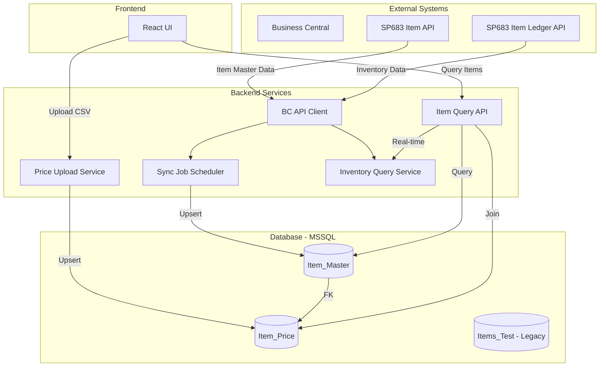

# Design Document: Item Data Migration from Business Central API

## Overview

ระบบนี้จะทำการ migrate โครงสร้างข้อมูล Item จากแบบ monolithic (Items_Test table) ไปเป็นแบบ normalized (Item_Master และ Item_Price tables) โดยใช้ Business Central API เป็น source of truth สำหรับข้อมูล Item Master และ Inventory

**Key Design Decisions:**

1. **Separation of Concerns**: แยกข้อมูล master data (Item_Master) ออกจากข้อมูลราคา (Item_Price) เพื่อให้สามารถ update ราคาได้โดยไม่กระทบข้อมูล master
2. **Hybrid Data Strategy**: 
   - Item Master: Sync จาก API มาเก็บใน MSSQL (for fast query)
   - Inventory: Query แบบ real-time จาก API (for accuracy)
   - Price: Upload โดยพนักงาน (existing workflow)
3. **API-First Approach**: ใช้ Business Central API เป็น source of truth แทนการพึ่งพาข้อมูลใน Items_Test
4. **Backward Compatibility**: รักษา Items_Test table ไว้ระหว่าง transition period

## Architecture



**Component Responsibilities:**

- **BC API Client**: Handle all communication with Business Central APIs (authentication, retry, error handling)
- **Sync Job Scheduler**: Periodically sync Item Master data from BC API to MSSQL
- **Price Upload Service**: Process CSV/Excel uploads and update Item_Price table
- **Inventory Query Service**: Query real-time inventory from BC Item Ledger API with caching
- **Item Query API**: Provide unified API for frontend to query items with master data, prices, and inventory

## Components and Interfaces

### 1. BC API Client

**Purpose**: Centralized client for all Business Central API communications

**Interface:**
```python
class BCAPIClient:
    def __init__(self, base_url: str, api_key: str):
        """Initialize with API credentials from environment"""
        pass
    
    def fetch_items(self, skip: int = 0, top: int = 100) -> List[Dict]:
        """Fetch items from SP683 Item API with pagination
        
        Args:
            skip: Number of records to skip (for pagination)
            top: Number of records to fetch (max 100)
            
        Returns:
            List of item dictionaries with BC API fields
            
        Raises:
            AuthenticationError: When API key is invalid
            APIError: When API returns error response
        """
        pass
    
    def fetch_inventory(self, item_no: str) -> List[Dict]:
        """Fetch inventory ledger entries for specific item
        
        Args:
            item_no: Item number (SKU) to query
            
        Returns:
            List of ledger entries with Item_No_, Quantity, Branch_Code
            
        Raises:
            AuthenticationError: When API key is invalid
            APIError: When API returns error response
        """
        pass
    
    def _make_request(self, url: str, params: Dict = None, retry_count: int = 3) -> Dict:
        """Internal method to make HTTP request with retry logic"""
        pass
```

**Error Handling:**
- Retry on network errors and 5xx responses (max 3 times with exponential backoff)
- No retry on 4xx errors (except 401/403 which raise AuthenticationError)
- Timeout after 30 seconds for Item API, 5 seconds for Ledger API

### 2. Database Models

**Item_Master Table:**
```sql
CREATE TABLE Item_Master (
    SKU VARCHAR(50) PRIMARY KEY,
    No_2 VARCHAR(50),
    Description NVARCHAR(255),
    Base_Unit_of_Measure VARCHAR(20),
    Inventory_Posting_Group VARCHAR(50),
    Product_Group VARCHAR(50),
    Product_Sub_Group VARCHAR(50),
    RE DECIMAL(18, 4),
    CreatedAt DATETIME DEFAULT GETDATE(),
    
    INDEX IX_Item_Master_Category (Inventory_Posting_Group),
    INDEX IX_Item_Master_ProductGroup (Product_Group)
);
```

**Item_Price Table:**
```sql
CREATE TABLE Item_Price (
    SKU VARCHAR(50) PRIMARY KEY,
    SDM DECIMAL(18, 4),
    R2 DECIMAL(18, 4),
    R1 DECIMAL(18, 4),
    W2 DECIMAL(18, 4),
    W1 DECIMAL(18, 4),
    UpdatedAt DATETIME DEFAULT GETDATE(),
    
    FOREIGN KEY (SKU) REFERENCES Item_Master(SKU) ON DELETE CASCADE
);
```

### 3. Sync Job Service

**Purpose**: Periodically sync Item Master data from BC API to MSSQL

**Interface:**
```python
class SyncJobService:
    def __init__(self, api_client: BCAPIClient, db_connection):
        """Initialize with API client and database connection"""
        pass
    
    def execute_sync(self) -> SyncResult:
        """Execute full sync of items from BC API to Item_Master table
        
        Returns:
            SyncResult with statistics (total_fetched, inserted, updated, errors)
        """
        pass
    
    def _map_api_to_db(self, api_item: Dict) -> Dict:
        """Map BC API fields to database columns
        
        Field mapping:
        - No_ -> SKU
        - No_2 -> No_2
        - Description -> Description
        - Base_Unit_of_Measure -> Base_Unit_of_Measure
        - Inventory_Posting_Group -> Inventory_Posting_Group
        - Product_Group -> Product_Group
        - Product_Subgroup -> Product_Sub_Group
        - Unit_Cost -> RE
        """
        pass
    
    def _upsert_item(self, item_data: Dict):
        """Insert or update item in Item_Master table"""
        pass
```

**Sync Strategy:**
- Fetch all items from BC API using pagination (100 items per request)
- For each item: check if SKU exists, update if exists, insert if not
- Log errors but continue processing remaining items
- Record sync statistics and execution time

### 4. Inventory Query Service

**Purpose**: Provide real-time inventory data with caching

**Interface:**
```python
class InventoryQueryService:
    def __init__(self, api_client: BCAPIClient, cache_ttl: int = 60):
        """Initialize with API client and cache TTL in seconds"""
        pass
    
    def get_inventory(self, sku: str) -> List[InventoryByBranch]:
        """Get inventory for SKU grouped by branch
        
        Args:
            sku: Item SKU to query
            
        Returns:
            List of InventoryByBranch objects with branch and quantity
            
        Uses cache with 60-second TTL to reduce API calls
        """
        pass
    
    def _fetch_from_api(self, sku: str) -> List[Dict]:
        """Fetch from BC Ledger API and aggregate by branch"""
        pass
```

**Caching Strategy:**
- Use in-memory cache (e.g., cachetools or Redis)
- TTL: 60 seconds
- Cache key: f"inventory:{sku}"
- Cache invalidation: automatic expiry only (no manual invalidation)

### 5. Price Upload Service

**Purpose**: Process price file uploads and update Item_Price table

**Interface:**
```python
class PriceUploadService:
    def __init__(self, db_connection):
        """Initialize with database connection"""
        pass
    
    def process_upload(self, file_path: str) -> UploadResult:
        """Process price file (CSV or Excel) and update Item_Price table
        
        Args:
            file_path: Path to uploaded file
            
        Returns:
            UploadResult with statistics (total_rows, successful, skipped, errors)
            
        Raises:
            ValidationError: When file format is invalid
        """
        pass
    
    def _validate_file(self, file_path: str) -> bool:
        """Validate file format and required columns"""
        pass
    
    def _parse_file(self, file_path: str) -> List[Dict]:
        """Parse CSV or Excel file into list of dictionaries"""
        pass
    
    def _upsert_price(self, price_data: Dict):
        """Insert or update price in Item_Price table
        
        Only process if SKU exists in Item_Master
        """
        pass
```

**Validation Rules:**
- Required columns: SKU, SDM, R2, R1, W2, W1
- SKU must exist in Item_Master table
- Price values must be non-negative decimals
- Skip rows with validation errors and log warnings

### 6. Item Query API

**Purpose**: Unified API endpoint for querying items with all data

**Endpoints:**

```python
@router.get("/items/{sku}")
def get_item_detail(sku: str) -> ItemDetail:
    """Get full item details including master data, prices, and inventory
    
    Args:
        sku: Item SKU or No_2
        
    Returns:
        ItemDetail object with all fields
        
    Raises:
        HTTPException 404: When SKU not found in Item_Master
    """
    pass

@router.get("/items")
def list_items(
    category: str = None,
    product_group: str = None,
    search: str = None,
    limit: int = 50,
    offset: int = 0
) -> ItemListResponse:
    """List items with filtering and pagination
    
    Args:
        category: Filter by Inventory_Posting_Group
        product_group: Filter by Product_Group
        search: Search in SKU, No_2, Description
        limit: Number of items to return
        offset: Number of items to skip
        
    Returns:
        ItemListResponse with items array and total count
    """
    pass
```

## Data Models

### API Response Models

**BC Item API Response:**
```python
@dataclass
class BCItemResponse:
    No_: str                          # -> SKU
    No_2: str                         # -> No_2
    Description: str                  # -> Description
    Base_Unit_of_Measure: str        # -> Base_Unit_of_Measure
    Inventory_Posting_Group: str     # -> Inventory_Posting_Group
    Product_Group: str               # -> Product_Group
    Product_Subgroup: str            # -> Product_Sub_Group
    Unit_Cost: Decimal               # -> RE
```

**BC Item Ledger API Response:**
```python
@dataclass
class BCLedgerEntry:
    Item_No_: str                    # Map to SKU
    Quantity: Decimal                # Sum by branch
    Branch_Code: str                 # Group by this field
```

### Database Models

**Item Master:**
```python
@dataclass
class ItemMaster:
    sku: str                         # Primary Key
    no_2: str
    description: str
    base_unit_of_measure: str
    inventory_posting_group: str
    product_group: str
    product_sub_group: str
    re: Decimal                      # Unit cost
    created_at: datetime
```

**Item Price:**
```python
@dataclass
class ItemPrice:
    sku: str                         # Primary Key, Foreign Key
    sdm: Decimal
    r2: Decimal
    r1: Decimal
    w2: Decimal
    w1: Decimal
    updated_at: datetime
```

### API Response Models

**Item Detail Response:**
```python
@dataclass
class ItemDetail:
    sku: str
    sku2: str                        # no_2
    name: str                        # description
    unit: str                        # base_unit_of_measure
    category: str                    # inventory_posting_group
    product_group: str
    product_sub_group: str
    re: Decimal
    prices: Optional[PriceData]      # null if no price data
    inventory: List[InventoryByBranch]  # real-time from API
```

**Price Data:**
```python
@dataclass
class PriceData:
    sdm: Decimal
    r2: Decimal
    r1: Decimal
    w2: Decimal
    w1: Decimal
    updated_at: datetime
```

**Inventory By Branch:**
```python
@dataclass
class InventoryByBranch:
    branch: str
    quantity: Decimal
```

**Item List Response:**
```python
@dataclass
class ItemListResponse:
    items: List[ItemSummary]
    total: int
    limit: int
    offset: int
```

**Item Summary:**
```python
@dataclass
class ItemSummary:
    sku: str
    sku2: str
    name: str
    category: str
    product_group: str
    product_sub_group: str
    # Note: No inventory in list view (too expensive to query real-time for all items)
```


## Correctness Properties

*A property is a characteristic or behavior that should hold true across all valid executions of a system—essentially, a formal statement about what the system should do. Properties serve as the bridge between human-readable specifications and machine-verifiable correctness guarantees.*

### Property Reflection

After analyzing all acceptance criteria, I identified several areas where properties can be consolidated:

**Consolidated Areas:**
1. **Field Mapping Properties**: Requirements 3.2 and 8.2 both test field mapping from source to destination. These can be combined into a single comprehensive mapping property.
2. **Upsert Logic**: Requirements 3.3/3.4 (Sync Job) and 5.5/5.6 (Price Upload) and 8.3/8.4 (Migration) all test insert-or-update logic. These follow the same pattern.
3. **Timestamp Properties**: Requirements 3.5 and 5.7 both test that timestamps are set correctly on insert/update.
4. **API Request Properties**: Requirements 2.2, 4.1, and 6.1 all test that API/database calls are made correctly with proper parameters.
5. **Response Format Properties**: Requirements 6.3/6.4/6.6 and 7.8 all test that response includes correct fields.
6. **Filtering Properties**: Requirements 7.2, 7.3, 7.4 all test filtering logic - can be combined into one comprehensive filtering property.
7. **Logging Properties**: Requirements 10.1, 10.4, 10.5, 10.6 all test logging format and content.

**Properties to Keep Separate:**
- Schema validation (1.x) - these are one-time setup examples
- Error handling (2.3-2.6, 4.5) - specific error scenarios
- Caching (4.6) - specific behavior
- Pagination (3.8, 7.5) - specific behavior
- Ordering (7.7) - specific behavior
- Scheduler (9.x) - operational examples

### Core Properties

**Property 1: API Field Mapping Consistency**

*For any* item data received from BC Item API or read from Items_Test table, when mapped to database format, the field mapping should follow the defined rules: No_ → SKU, No_2 → No_2, Description → Description, Base_Unit_of_Measure → Base_Unit_of_Measure, Inventory_Posting_Group → Inventory_Posting_Group, Product_Group → Product_Group, Product_Subgroup → Product_Sub_Group, Unit_Cost → RE

**Validates: Requirements 3.2, 8.2**

---

**Property 2: Upsert Idempotence**

*For any* item or price record, upserting the same data multiple times should result in the same final state as upserting once (idempotent operation)

**Validates: Requirements 3.3, 3.4, 5.5, 5.6, 8.3, 8.4**

---

**Property 3: Timestamp Consistency**

*For any* insert or update operation on Item_Master or Item_Price, the timestamp field (CreatedAt or UpdatedAt) should be set to a value within 1 second of the operation time

**Validates: Requirements 3.5, 5.7**

---

**Property 4: Authorization Header Presence**

*For any* API request made by BC_API_Client, the request should include an Authorization header with the configured API key

**Validates: Requirements 2.2**

---

**Property 5: JSON Parsing Correctness**

*For any* valid JSON response from BC API, the BC_API_Client should successfully parse it into structured data without errors

**Validates: Requirements 2.7**

---

**Property 6: Inventory Aggregation Correctness**

*For any* set of ledger entries for a given SKU, the Inventory_Query_Service should return the sum of Quantity grouped by Branch_Code, where the sum for each branch equals the sum of all Quantity values for that branch in the input

**Validates: Requirements 4.2**

---

**Property 7: Inventory Response Format**

*For any* SKU queried, the Inventory_Query_Service should return a list where each element contains branch and quantity fields

**Validates: Requirements 4.4**

---

**Property 8: File Format Validation**

*For any* file uploaded to Price_Upload_Service, the service should accept files with .csv or .xlsx/.xls extensions and reject all other formats

**Validates: Requirements 5.1**

---

**Property 9: Required Columns Validation**

*For any* price file parsed, the Price_Upload_Service should verify that columns SKU, SDM, R2, R1, W2, W1 exist, and reject files missing any required column

**Validates: Requirements 5.2**

---

**Property 10: SKU Existence Validation**

*For any* SKU in uploaded price file, the Price_Upload_Service should verify the SKU exists in Item_Master table before processing the price data

**Validates: Requirements 5.3**

---

**Property 11: Invalid SKU Handling**

*For any* SKU in uploaded price file that does not exist in Item_Master, the Price_Upload_Service should skip that row and continue processing remaining rows

**Validates: Requirements 5.4**

---

**Property 12: Upload Summary Completeness**

*For any* price file upload, the returned summary should contain total_rows, successful_updates, and errors counts, where total_rows = successful_updates + errors

**Validates: Requirements 5.8**

---

**Property 13: Item Query Response Completeness**

*For any* existing SKU queried via Item_Query_API, the response should contain all item master fields, price fields (or null if no price), and inventory fields

**Validates: Requirements 6.3, 6.4, 6.6**

---

**Property 14: Alternative SKU Lookup**

*For any* item with No_2 value, querying Item_Query_API by either SKU or No_2 should return the same item data

**Validates: Requirements 6.8**

---

**Property 15: Not Found Error Handling**

*For any* SKU that does not exist in Item_Master, querying Item_Query_API should return HTTP 404 status

**Validates: Requirements 6.7**

---

**Property 16: List Filtering Correctness**

*For any* combination of category, product_group, and search filters applied to Item_List_API, all returned items should match all specified filters

**Validates: Requirements 7.2, 7.3, 7.4**

---

**Property 17: Pagination Correctness**

*For any* limit and offset values, Item_List_API should return exactly limit items (or fewer if near end) starting from position offset in the filtered result set

**Validates: Requirements 7.5**

---

**Property 18: Total Count Accuracy**

*For any* filter combination, the total count returned by Item_List_API should equal the actual number of items matching those filters in the database

**Validates: Requirements 7.6**

---

**Property 19: Result Ordering**

*For any* query to Item_List_API, the returned items should be ordered by SKU in ascending lexicographic order

**Validates: Requirements 7.7**

---

**Property 20: Migration Duplicate Handling**

*For any* duplicate SKU encountered during migration, the Migration_Script should skip the duplicate and continue processing remaining records

**Validates: Requirements 8.5**

---

**Property 21: Sync Job Logging Completeness**

*For any* Sync_Job execution, the log should contain start_time, end_time, status, total_fetched, inserted, updated, and errors counts

**Validates: Requirements 9.6, 10.4**

---

**Property 22: Error Logging Format**

*For any* error logged by the system, the log entry should contain timestamp, component_name, error_message, and stack_trace fields

**Validates: Requirements 10.1**

---

**Property 23: Upload Logging Completeness**

*For any* price upload operation, the log should contain file_name, total_rows, successful_updates, and errors

**Validates: Requirements 10.5**

---

**Property 24: Log Level Correctness**

*For any* error logged, critical errors (authentication failures, database connection failures) should use ERROR level, while recoverable issues (invalid SKU in upload, API retry) should use WARN level

**Validates: Requirements 10.6**

---

## Error Handling

### API Client Error Handling

**Network Errors:**
- Retry up to 3 times with exponential backoff (1s, 2s, 4s)
- Log each retry attempt
- Raise `NetworkError` after final failure

**HTTP Status Codes:**
- 401/403: Raise `AuthenticationError` immediately (no retry)
- 4xx (other): Raise `ClientError` immediately (no retry)
- 5xx: Retry up to 3 times, then raise `ServerError`
- Timeout: Retry up to 3 times, then raise `TimeoutError`

**Response Parsing:**
- Invalid JSON: Raise `ParseError` (no retry)
- Missing required fields: Raise `ValidationError` (no retry)

### Sync Job Error Handling

**Item Processing Errors:**
- Log error with item SKU and error details
- Continue processing remaining items
- Include error count in final summary

**Database Errors:**
- Transient errors (deadlock, timeout): Retry individual item
- Permanent errors (constraint violation): Log and skip item
- Connection errors: Fail entire sync job

**API Errors:**
- Handle according to API Client error handling
- If API completely unavailable, fail sync job

### Price Upload Error Handling

**File Validation Errors:**
- Invalid format: Return error immediately (don't process)
- Missing columns: Return error immediately (don't process)

**Row Processing Errors:**
- Invalid SKU: Skip row, log warning, continue
- Invalid price value: Skip row, log warning, continue
- Database error: Skip row, log error, continue

**Summary:**
- Always return summary even if all rows failed
- Include detailed error messages for each failed row

### Inventory Query Error Handling

**API Errors:**
- Timeout (>5s): Return error to caller
- Network error: Return error to caller (no retry for real-time query)
- 5xx error: Return error to caller

**Cache Errors:**
- Cache read failure: Query API directly
- Cache write failure: Log warning, return data anyway

**Empty Results:**
- Return empty list (not an error)

### General Error Handling Principles

1. **Fail Fast for Configuration Errors**: Invalid config should prevent startup
2. **Graceful Degradation**: Continue processing when possible
3. **Detailed Logging**: Always log enough context to debug
4. **User-Friendly Messages**: Return clear error messages to API callers
5. **No Silent Failures**: Every error should be logged or returned

## Testing Strategy

### Dual Testing Approach

This feature requires both unit tests and property-based tests for comprehensive coverage:

**Unit Tests** focus on:
- Specific examples and edge cases
- Integration points between components
- Error conditions and boundary cases
- Schema validation and setup

**Property-Based Tests** focus on:
- Universal properties across all inputs
- Data transformation correctness
- API contract validation
- Business logic invariants

Both approaches are complementary and necessary. Unit tests catch concrete bugs in specific scenarios, while property tests verify general correctness across a wide range of inputs.

### Property-Based Testing Configuration

**Framework**: Use `hypothesis` for Python (or equivalent PBT library for chosen language)

**Test Configuration:**
- Minimum 100 iterations per property test
- Each test tagged with: `Feature: item-data-migration, Property {N}: {property_text}`
- Use appropriate generators for each data type (SKU patterns, decimal prices, timestamps)

**Property Test Implementation:**

Each correctness property listed above should be implemented as a single property-based test. For example:

```python
# Property 1: API Field Mapping Consistency
@given(bc_item=bc_item_generator())
@settings(max_examples=100)
def test_api_field_mapping_consistency(bc_item):
    """Feature: item-data-migration, Property 1: API Field Mapping Consistency"""
    mapped = map_api_to_db(bc_item)
    assert mapped['SKU'] == bc_item['No_']
    assert mapped['No_2'] == bc_item['No_2']
    # ... verify all field mappings
```

### Unit Testing Focus Areas

**Database Schema Tests:**
- Verify tables exist with correct columns (Requirements 1.1, 1.2)
- Verify indexes exist (Requirements 1.4, 1.5, 1.6)
- Verify foreign key constraint and CASCADE behavior (Requirement 1.3)

**API Client Tests:**
- Configuration loading (Requirement 2.1)
- Retry logic for network errors (Requirement 2.3)
- No retry for 401/403 (Requirement 2.4)
- Retry for 5xx (Requirement 2.5)
- No retry for 4xx (Requirement 2.6)

**Sync Job Tests:**
- API is called (Requirement 3.1)
- Pagination works correctly (Requirement 3.8)
- Logging on success (Requirement 3.6)
- Error handling and continuation (Requirement 3.7)

**Inventory Service Tests:**
- Empty result handling (Requirement 4.3 - edge case)
- Timeout behavior (Requirement 4.5)
- Cache behavior (Requirement 4.6)

**Scheduler Tests:**
- Schedule configuration (Requirement 9.1)
- Automatic execution (Requirement 9.2)
- Concurrent execution prevention (Requirement 9.3)
- Manual trigger (Requirements 9.4, 9.5)

**Migration Tests:**
- Reads from Items_Test (Requirement 8.1)
- Logging on completion (Requirement 8.7)

**Logging Tests:**
- API failure logging (Requirement 10.2)
- Database error logging (Requirement 10.3)
- Log rotation configuration (Requirement 10.7)

### Integration Testing

**End-to-End Scenarios:**
1. Full sync job execution with mocked BC API
2. Price upload with validation and database updates
3. Item query with master data, prices, and real-time inventory
4. List query with multiple filters and pagination

**Test Data:**
- Use realistic SKU patterns (A01010100101, C02020200202, etc.)
- Include edge cases (missing No_2, null prices, zero inventory)
- Test with multiple branches for inventory aggregation

### Test Environment

**Database:**
- Use test database with same schema as production
- Reset database between tests
- Use transactions for test isolation

**External APIs:**
- Mock BC APIs for unit and integration tests
- Use recorded responses for realistic data
- Test with actual API in staging environment

**Caching:**
- Use separate cache instance for tests
- Clear cache between tests
- Test cache expiry behavior
