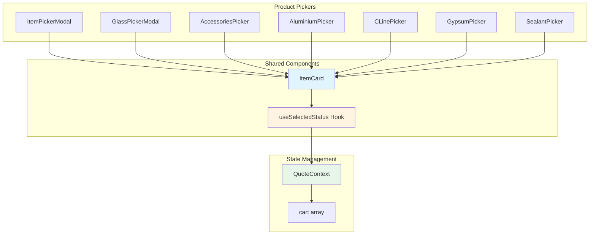

# เอกสารการออกแบบ: Selected Product Indicator

## Overview

ฟีเจอร์นี้จะเพิ่มการแสดงสถานะของสินค้าที่ถูกเลือกแล้วในรายการสินค้าของแต่ละ Product Picker โดยการเปลี่ยนสีตัวอักษรของชื่อสินค้า เพื่อให้ผู้ใช้สามารถระบุได้ทันทีว่าสินค้าไหนถูกเพิ่มเข้าใบเสนอราคาไปแล้ว

### ปัญหาที่แก้ไข

ปัจจุบันเมื่อผู้ใช้เลือกสินค้าจากหลาย Picker ผู้ใช้ไม่สามารถทราบได้ว่าสินค้าไหนถูกเลือกไปแล้วในรายการ ทำให้อาจเกิดการเลือกสินค้าซ้ำหรือสับสนในการเลือกสินค้า

### แนวทางการแก้ไข

1. **ตรวจสอบสถานะ**: เมื่อแสดงรายการสินค้าใน Product Picker จะตรวจสอบว่าสินค้านั้นมีอยู่ใน cart ของ QuoteContext หรือไม่
2. **แสดงผลแตกต่าง**: สินค้าที่ถูกเลือกแล้วจะแสดงด้วยสีตัวอักษรที่แตกต่างจากสินค้าที่ยังไม่ได้เลือก
3. **อัพเดทเรียลไทม์**: เมื่อมีการเพิ่มหรือลบสินค้าจาก cart การแสดงผลจะอัพเดททันที
4. **ความสอดคล้อง**: ใช้สีและรูปแบบเดียวกันในทุก Picker component

## Architecture

### ภาพรวมของระบบ



### การไหลของข้อมูล

1. **Product Picker** แสดงรายการสินค้าผ่าน **ItemCard** component
2. **ItemCard** ใช้ **useSelectedStatus** hook เพื่อตรวจสอบสถานะการเลือก
3. **useSelectedStatus** อ่านข้อมูลจาก **QuoteContext.cart** เพื่อเช็คว่าสินค้านั้นถูกเลือกแล้วหรือไม่
4. **ItemCard** แสดงผลด้วยสีที่แตกต่างกันตามสถานะที่ได้รับ

## Components and Interfaces

### 1. useSelectedStatus Hook

Custom React hook สำหรับตรวจสอบว่าสินค้าถูกเลือกแล้วหรือไม่

**Interface:**
```javascript
/**
 * Hook สำหรับตรวจสอบสถานะการเลือกสินค้า
 * @param {string} sku - รหัสสินค้า
 * @param {string|null} variantCode - รหัส variant (optional)
 * @param {number} sqft - ขนาดตารางฟุต (สำหรับกระจก)
 * @returns {boolean} true ถ้าสินค้าถูกเลือกแล้ว, false ถ้ายังไม่ได้เลือก
 */
function useSelectedStatus(sku, variantCode = null, sqft = 0)
```

**การทำงาน:**
- อ่านข้อมูล cart จาก QuoteContext
- เปรียบเทียบ sku, variantCode, และ sqft_sheet กับสินค้าใน cart
- คืนค่า boolean บอกสถานะการเลือก
- Re-render อัตโนมัติเมื่อ cart เปลี่ยนแปลง (ผ่าน React context)

**การจัดการ Edge Cases:**
- ถ้า sku เป็น null/undefined → คืนค่า false
- ถ้า variantCode เป็น empty string → normalize เป็น null
- ถ้า sqft เป็น undefined → normalize เป็น 0
- รองรับทั้ง field name `sqft_sheet` และ `sqft`

### 2. ItemCard Component (Modified)

Component ที่แสดงข้อมูลสินค้าในรายการ จะถูกปรับปรุงให้รองรับการแสดงสถานะการเลือก

**Props Interface:**
```javascript
{
  item: {
    sku: string,
    SKU?: string,           // รองรับทั้ง lowercase และ uppercase
    name: string,
    variantCode?: string,
    VariantCode?: string,   // รองรับทั้ง camelCase และ PascalCase
    sqft_sheet?: number,
    sqft?: number,
    // ... fields อื่นๆ
  },
  onAdd: (item, qty) => void
}
```

**การแสดงผล:**
- ใช้ `useSelectedStatus` hook เพื่อตรวจสอบสถานะ
- ถ้าสินค้าถูกเลือกแล้ว: แสดงชื่อสินค้าด้วยสี `text-blue-600` และ `font-semibold`
- ถ้าสินค้ายังไม่ได้เลือก: แสดงชื่อสินค้าด้วยสี `text-gray-900` (default)
- เพิ่ม visual indicator เล็กๆ (✓) ข้างชื่อสินค้าที่ถูกเลือกแล้ว

### 3. Product Picker Components (No Changes Required)

Component ต่างๆ เหล่านี้ไม่ต้องแก้ไข เพราะใช้ ItemCard อยู่แล้ว:
- ItemPickerModal
- GlassPickerModal
- AccessoriesPicker
- AluminiumPicker
- CLinePicker
- GypsumPicker
- SealantPicker

การเปลี่ยนแปลงใน ItemCard จะส่งผลไปยัง Picker ทั้งหมดโดยอัตโนมัติ

### 4. QuoteContext (No Changes Required)

QuoteContext ไม่ต้องแก้ไข เพราะมี cart array อยู่แล้วและสามารถอ่านได้ผ่าน `useQuote()` hook

## Data Models

### Cart Item Structure

โครงสร้างข้อมูลของสินค้าใน cart (อ้างอิงจาก QuoteContext):

```javascript
{
  sku: string,              // รหัสสินค้า (required, unique identifier)
  name: string,             // ชื่อสินค้า
  qty: number,              // จำนวน
  variantCode: string|null, // รหัส variant (optional)
  sqft_sheet: number,       // ขนาดตารางฟุต (สำหรับกระจก, default: 0)
  unit: string|null,        // หน่วย
  price: number,            // ราคาต่อหน่วย (สินค้าทั่วไป)
  price_per_sheet: number,  // ราคาต่อแผ่น (กระจก)
  lineTotal: number,        // ราคารวมของบรรทัด
  // ... fields อื่นๆ
}
```

### Product Identity Matching

การระบุว่าสินค้าเป็นตัวเดียวกันหรือไม่ ใช้เกณฑ์:

1. **sku** ต้องตรงกัน (required)
2. **variantCode** ต้องตรงกัน (ถ้ามี)
   - null และ undefined ถือว่าเหมือนกัน
   - empty string ("") จะถูก normalize เป็น null
3. **sqft_sheet** ต้องตรงกัน (สำหรับกระจก)
   - undefined จะถูก normalize เป็น 0
   - เปรียบเทียบเป็น number

**ตัวอย่าง:**
```javascript
// สินค้าเดียวกัน
{ sku: "A001", variantCode: null, sqft_sheet: 0 }
{ sku: "A001", variantCode: undefined, sqft_sheet: 0 }

// สินค้าคนละตัว
{ sku: "A001", variantCode: "V1", sqft_sheet: 0 }
{ sku: "A001", variantCode: "V2", sqft_sheet: 0 }

// สินค้าคนละตัว (กระจกขนาดต่างกัน)
{ sku: "G001", variantCode: null, sqft_sheet: 10 }
{ sku: "G001", variantCode: null, sqft_sheet: 20 }
```

### Visual Indicator Styles

```javascript
const SELECTED_STYLES = {
  textColor: "text-blue-600",
  fontWeight: "font-semibold",
  indicator: "✓"
};

const DEFAULT_STYLES = {
  textColor: "text-gray-900",
  fontWeight: "font-normal",
  indicator: null
};
```

## Correctness Properties

Property (คุณสมบัติความถูกต้อง) คือลักษณะหรือพฤติกรรมที่ควรเป็นจริงในทุกการทำงานของระบบ เป็นการระบุอย่างเป็นทางการว่าระบบควรทำอะไร Properties เหล่านี้จะเป็นพื้นฐานสำหรับการทดสอบแบบ property-based testing ที่จะตรวจสอบความถูกต้องของระบบอย่างครอบคลุม

### Property 1: Selection Status Detection

*For any* product with a valid SKU and any cart state, the `useSelectedStatus` hook should return `true` if and only if the cart contains a product with matching SKU, variantCode, and sqft_sheet values

**Validates: Requirements 1.1, 5.1, 5.2**

**รายละเอียด:**
- ต้องตรวจสอบทั้ง 3 fields: sku, variantCode, sqft_sheet
- variantCode ที่เป็น null, undefined, หรือ "" ถือว่าเหมือนกัน
- sqft_sheet ที่เป็น undefined ถือว่าเป็น 0
- ต้องรองรับทั้ง field name `sqft_sheet` และ `sqft`

### Property 2: Visual Indicator Consistency

*For any* product item rendered in ItemCard, if the product is selected (exists in cart), the component should render with `text-blue-600` and `font-semibold` classes; if not selected, it should render with `text-gray-900` and `font-normal` classes

**Validates: Requirements 1.2, 1.3, 2.1**

**รายละเอียด:**
- การแสดงผลต้องสอดคล้องกับสถานะจาก `useSelectedStatus`
- ใช้ CSS classes เดียวกันในทุกกรณี
- เพิ่ม indicator "✓" สำหรับสินค้าที่ถูกเลือก

### Property 3: Initial State Correctness

*For any* cart state when a Product Picker is opened, all products in the displayed list should immediately show the correct selection status based on the current cart contents

**Validates: Requirements 3.3**

**รายละเอียด:**
- ไม่ต้องรอ interaction ใดๆ
- สถานะต้องถูกต้องตั้งแต่ render ครั้งแรก
- ต้องอ่านจาก QuoteContext ที่เป็น current state

### Property 4: Product Identity Matching with Variants

*For any* two products with the same SKU but different variantCode or sqft_sheet values, they should be treated as different products and have independent selection status

**Validates: Requirements 5.2**

**รายละเอียด:**
- สินค้า SKU เดียวกันแต่ variant ต่างกัน = คนละสินค้า
- กระจก SKU เดียวกันแต่ขนาดต่างกัน = คนละสินค้า
- การเลือกสินค้าหนึ่งต้องไม่กระทบสถานะของอีกสินค้า

### Property 5: Invalid Product Identifier Handling (Edge Case)

*For any* product with missing or invalid SKU (null, undefined, empty string), the `useSelectedStatus` hook should return `false` and the product should display with default styling

**Validates: Requirements 5.3**

**รายละเอียด:**
- ป้องกัน error จาก invalid data
- แสดงผลแบบ graceful degradation
- ไม่ crash component

## Error Handling

### 1. Missing Product Identifier

**สถานการณ์:** สินค้าไม่มี SKU หรือ SKU เป็น null/undefined

**การจัดการ:**
- `useSelectedStatus` คืนค่า `false`
- แสดงสินค้าด้วย default styling
- Log warning ใน console (development mode)
- ไม่ throw error เพื่อไม่ให้ UI crash

**ตัวอย่าง:**
```javascript
if (!sku || sku.trim() === "") {
  console.warn("Product missing SKU:", item);
  return false;
}
```

### 2. Cart Data Inconsistency

**สถานการณ์:** cart มีข้อมูลที่ไม่สมบูรณ์หรือ format ผิด

**การจัดการ:**
- ใช้ optional chaining และ nullish coalescing
- Normalize ค่าก่อนเปรียบเทียบ
- ถือว่า missing fields เป็น default values

**ตัวอย่าง:**
```javascript
const cartVariant = item.variantCode ?? null;
const cartSqft = Number(item.sqft_sheet ?? item.sqft ?? 0);
```

### 3. Context Not Available

**สถานการณ์:** Component ถูก render นอก QuoteProvider

**การจัดการ:**
- `useQuote` hook จะ throw error ตาม React context pattern
- แสดง error boundary หรือ fallback UI
- ไม่ควรเกิดใน production ถ้า setup ถูกต้อง

## Testing Strategy

### Dual Testing Approach

ระบบนี้จะใช้การทดสอบแบบผสมผสานระหว่าง **Unit Tests** และ **Property-Based Tests** เพื่อให้ได้ความครอบคลุมที่สมบูรณ์

#### Unit Tests

Unit tests จะใช้สำหรับ:
- **Specific Examples**: ทดสอบกรณีเฉพาะเจาะจง เช่น สินค้า SKU "A001" ถูกเลือก
- **Edge Cases**: ทดสอบกรณีพิเศษ เช่น SKU เป็น null, empty string
- **Integration Points**: ทดสอบการทำงานร่วมกันของ components
- **Real-time Updates**: ทดสอบการอัพเดท UI เมื่อ cart เปลี่ยน (3.1, 3.2, 4.1)

**ตัวอย่าง Unit Tests:**
```javascript
describe("ItemCard with selected product", () => {
  it("should display selected product with blue text", () => {
    // Test specific example
  });
  
  it("should update styling when product is added to cart", () => {
    // Test real-time update (Requirement 3.1)
  });
  
  it("should restore default styling when product is removed", () => {
    // Test real-time update (Requirement 3.2)
  });
  
  it("should maintain onAdd functionality", () => {
    // Test existing functionality (Requirement 4.1)
  });
});
```

#### Property-Based Tests

Property-based tests จะใช้สำหรับ:
- **Universal Properties**: ทดสอบคุณสมบัติที่ต้องเป็นจริงกับ input ทุกชุด
- **Comprehensive Coverage**: สร้าง input แบบสุ่มหลายร้อยชุดเพื่อหา edge cases
- **Correctness Validation**: ตรวจสอบว่า properties ทั้ง 5 ข้อเป็นจริงเสมอ

**Property-Based Testing Library:**
- ใช้ **fast-check** สำหรับ JavaScript/React testing
- กำหนดให้รันอย่างน้อย **100 iterations** ต่อ property test
- แต่ละ test ต้อง tag ด้วย comment อ้างอิง property จาก design

**Tag Format:**
```javascript
// Feature: selected-product-indicator, Property 1: Selection Status Detection
test("property: selection status detection", () => {
  fc.assert(
    fc.property(
      // generators...
      (sku, cart) => {
        // test property...
      }
    ),
    { numRuns: 100 }
  );
});
```

**ตัวอย่าง Property Tests:**
```javascript
// Feature: selected-product-indicator, Property 1: Selection Status Detection
test("property: selection status matches cart contents", () => {
  fc.assert(
    fc.property(
      fc.string(), // random SKU
      fc.option(fc.string()), // random variantCode
      fc.nat(), // random sqft
      fc.array(cartItemArbitrary), // random cart
      (sku, variant, sqft, cart) => {
        const isSelected = useSelectedStatus(sku, variant, sqft);
        const existsInCart = cart.some(item => 
          item.sku === sku && 
          (item.variantCode ?? null) === (variant ?? null) &&
          Number(item.sqft_sheet ?? 0) === sqft
        );
        return isSelected === existsInCart;
      }
    ),
    { numRuns: 100 }
  );
});

// Feature: selected-product-indicator, Property 4: Product Identity Matching with Variants
test("property: variants are independent", () => {
  fc.assert(
    fc.property(
      fc.string(), // same SKU
      fc.string(), // variant1
      fc.string(), // variant2
      fc.array(cartItemArbitrary), // cart
      (sku, v1, v2) => {
        fc.pre(v1 !== v2); // ensure different variants
        
        const cart = [{ sku, variantCode: v1, sqft_sheet: 0 }];
        const status1 = useSelectedStatus(sku, v1, 0);
        const status2 = useSelectedStatus(sku, v2, 0);
        
        return status1 === true && status2 === false;
      }
    ),
    { numRuns: 100 }
  );
});
```

### Test Coverage Goals

- **Unit Tests**: ครอบคลุม specific examples, edge cases, และ integration scenarios
- **Property Tests**: ครอบคลุม universal properties ทั้ง 5 ข้อ
- **Code Coverage**: เป้าหมาย 90%+ สำหรับ code ใหม่
- **Mutation Testing**: ใช้เพื่อตรวจสอบคุณภาพของ tests

### Testing Tools

- **Test Framework**: Jest + React Testing Library
- **Property Testing**: fast-check
- **Coverage**: Jest built-in coverage
- **CI/CD**: รัน tests ทุกครั้งที่ push code

