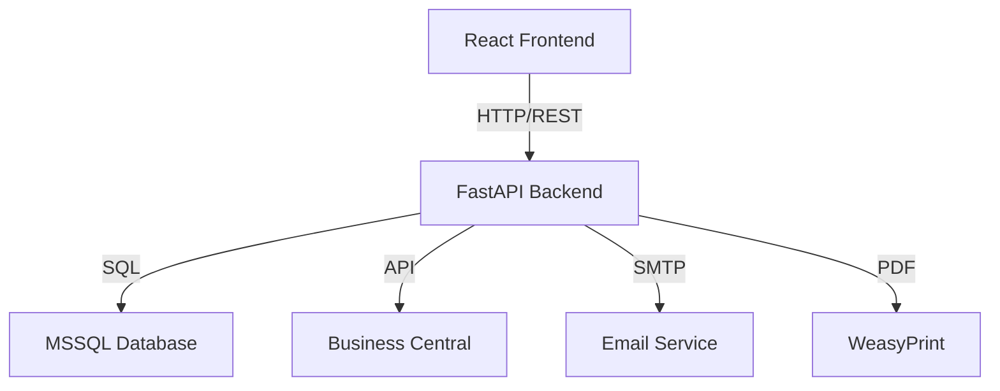
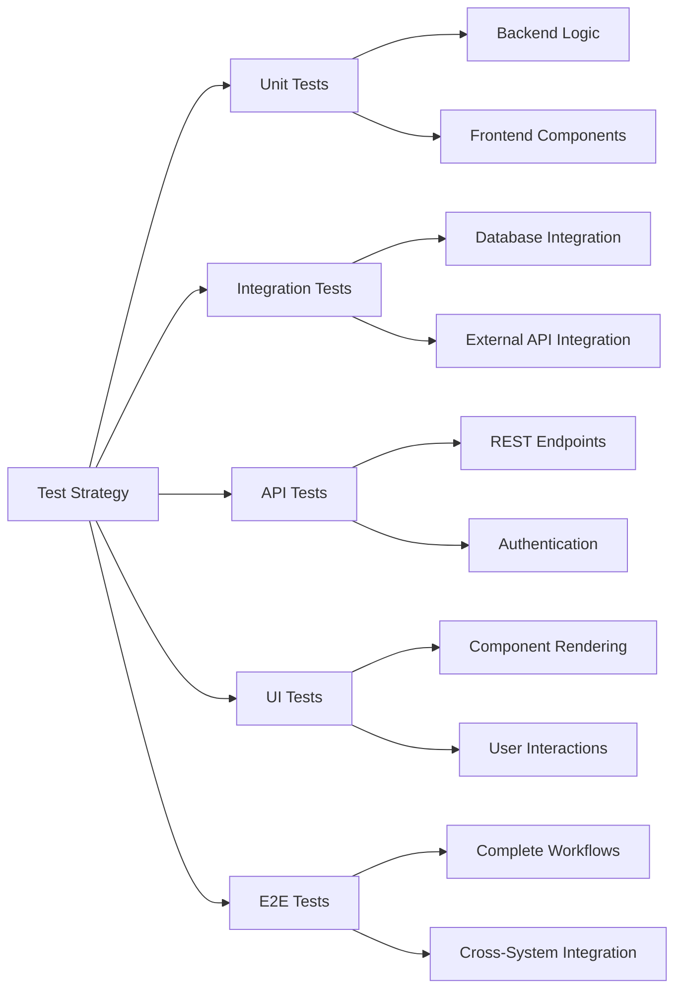

# Test Plan: ระบบใบเสนอราคา (Quotation System)

## ภาพรวม

เอกสารนี้เป็น Test Plan ที่ครอบคลุมสำหรับระบบใบเสนอราคา ซึ่งประกอบด้วย Frontend (React) และ Backend (FastAPI/Python) โดยมีฟีเจอร์หลักดังนี้:

- การค้นหาลูกค้า (Customer Search)
- การเลือกสินค้า (Item Picker) และกระจก (Glass Picker)
- การแก้ไขราคา (Price Edit)
- การขอราคาพิเศษ (Special Price Request) พร้อมระบบอนุมัติทาง email
- สรุปใบเสนอราคา (Summary)
- การส่งออก PDF
- การซิงค์ข้อมูลกับ Business Central

Test Plan นี้ครอบคลุม Unit Tests, Integration Tests, E2E Tests, API Tests และ UI Tests

## สถาปัตยกรรมระบบ



## โครงสร้างการทดสอบ




## 1. Unit Tests

### 1.1 Backend Unit Tests (Python/FastAPI)

#### Testing Framework
- **Framework**: pytest
- **Coverage Tool**: pytest-cov
- **Mocking**: pytest-mock, unittest.mock

#### Test Categories

##### 1.1.1 Business Logic Tests

```python
# tests/unit/test_quotation_logic.py

def test_generate_quote_no_format():
    """
    ทดสอบการสร้างเลขที่ใบเสนอราคา
    Format: BSQT-2502/0001
    """
    INPUT: branch_code = "BS"
    OUTPUT: quote_no ที่มี format ถูกต้อง
    
    ASSERT quote_no matches pattern "^[A-Z]{2}QT-\d{4}/\d{4}$"
    ASSERT prefix contains branch_code
    ASSERT contains current year-month

def test_calculate_line_total_regular_item():
    """
    ทดสอบการคำนวณยอดรวมสินค้าทั่วไป
    """
    INPUT: qty = 10, price = 100
    OUTPUT: line_total = 1000
    
    ASSERT line_total = qty * price

def test_calculate_line_total_glass_item():
    """
    ทดสอบการคำนวณยอดรวมสินค้ากระจก
    """
    INPUT: qty = 5, price = 200, sqft_sheet = 10
    OUTPUT: line_total = 10000
    
    ASSERT line_total = price * sqft_sheet * qty
    ASSERT category = "G"

def test_normalize_customer_code():
    """
    ทดสอบการจัดการรหัสลูกค้า
    """
    INPUT: customer with empty code but has name
    OUTPUT: cust_code = "N/A", cust_name = provided name
    
    ASSERT cust_code = "N/A" when code is empty
    ASSERT cust_name = "ลูกค้าใหม่" when name is empty
```

##### 1.1.2 Data Validation Tests

```python
# tests/unit/test_validation.py

def test_validate_quotation_payload():
    """
    ทดสอบการตรวจสอบข้อมูลใบเสนอราคา
    """
    INPUT: payload with missing required fields
    OUTPUT: ValidationError
    
    ASSERT raises HTTPException when cart is empty
    ASSERT raises HTTPException when customer is missing
    ASSERT raises HTTPException when employee is missing

def test_validate_price_edit():
    """
    ทดสอบการตรวจสอบการแก้ไขราคา
    """
    INPUT: new_price < 0
    OUTPUT: ValidationError
    
    ASSERT price >= 0
    ASSERT price <= max_allowed_price

def test_validate_special_price_request():
    """
    ทดสอบการตรวจสอบคำขอราคาพิเศษ
    """
    INPUT: discount > 100%
    OUTPUT: ValidationError
    
    ASSERT discount_percent <= 100
    ASSERT discount_percent >= 0
    ASSERT reason is not empty
```


##### 1.1.3 Database Operation Tests

```python
# tests/unit/test_database_operations.py

def test_create_quotation_header():
    """
    ทดสอบการสร้าง header ใบเสนอราคา
    """
    INPUT: valid header data
    OUTPUT: record inserted successfully
    
    ASSERT record exists in Quote_Header table
    ASSERT QuoteNo is unique
    ASSERT all required fields are populated

def test_create_quotation_lines():
    """
    ทดสอบการสร้าง line items
    """
    INPUT: list of cart items
    OUTPUT: records inserted successfully
    
    ASSERT number of records = number of cart items
    ASSERT all line items linked to correct QuoteID
    ASSERT TotalPrice calculated correctly

def test_update_quotation():
    """
    ทดสอบการอัปเดตใบเสนอราคา
    """
    INPUT: existing quote_no, updated payload
    OUTPUT: record updated successfully
    
    ASSERT LastUpdate timestamp is updated
    ASSERT old line items are deleted
    ASSERT new line items are inserted
```

##### 1.1.4 Email Service Tests

```python
# tests/unit/test_email_service.py

def test_send_approval_email():
    """
    ทดสอบการส่ง email ขออนุมัติ
    """
    INPUT: special_price_request data
    OUTPUT: email sent successfully
    
    ASSERT email contains approval link
    ASSERT email contains rejection link
    ASSERT email contains request details

def test_parse_email_reply():
    """
    ทดสอบการแปลง email reply
    """
    INPUT: email with approval token
    OUTPUT: approval status updated
    
    ASSERT token is valid
    ASSERT status changed to "approved" or "rejected"
    ASSERT timestamp recorded
```

### 1.2 Frontend Unit Tests (React)

#### Testing Framework
- **Framework**: Vitest
- **Testing Library**: @testing-library/react
- **Mocking**: vi (Vitest mocking)

#### Test Categories

##### 1.2.1 Component Rendering Tests

```javascript
// tests/unit/components/CustomerSearchSection.test.jsx

describe('CustomerSearchSection', () => {
  test('renders search input', () => {
    INPUT: component mounted
    OUTPUT: search input is visible
    
    ASSERT search input exists
    ASSERT placeholder text is correct
  })

  test('displays search results', async () => {
    INPUT: search query "test"
    OUTPUT: results list displayed
    
    ASSERT results list is visible
    ASSERT results contain matching customers
  })

  test('handles empty search results', async () => {
    INPUT: search query with no matches
    OUTPUT: empty state message
    
    ASSERT "ไม่พบข้อมูล" message is displayed
  })
})
```


##### 1.2.2 User Interaction Tests

```javascript
// tests/unit/components/ItemPickerModal.test.jsx

describe('ItemPickerModal', () => {
  test('adds item to cart on click', async () => {
    INPUT: click on item
    OUTPUT: item added to cart
    
    ASSERT onAddItem callback is called
    ASSERT cart count increases
  })

  test('filters items by category', async () => {
    INPUT: select category filter
    OUTPUT: filtered items displayed
    
    ASSERT only items from selected category are shown
  })

  test('searches items by keyword', async () => {
    INPUT: type search keyword
    OUTPUT: matching items displayed
    
    ASSERT items match search keyword
    ASSERT search is case-insensitive
  })
})

// tests/unit/components/PriceEditModal.test.jsx

describe('PriceEditModal', () => {
  test('validates price input', async () => {
    INPUT: negative price
    OUTPUT: validation error
    
    ASSERT error message is displayed
    ASSERT save button is disabled
  })

  test('updates price on save', async () => {
    INPUT: valid new price
    OUTPUT: price updated
    
    ASSERT onSave callback is called with new price
    ASSERT modal closes
  })
})
```

##### 1.2.3 State Management Tests

```javascript
// tests/unit/hooks/useCart.test.js

describe('useCart hook', () => {
  test('adds item to cart', () => {
    INPUT: addItem(item)
    OUTPUT: cart contains item
    
    ASSERT cart.length increases
    ASSERT item exists in cart
  })

  test('removes item from cart', () => {
    INPUT: removeItem(itemId)
    OUTPUT: item removed from cart
    
    ASSERT cart.length decreases
    ASSERT item does not exist in cart
  })

  test('calculates cart totals', () => {
    INPUT: cart with multiple items
    OUTPUT: correct totals
    
    ASSERT subtotal = sum of line totals
    ASSERT grandTotal = subtotal + shipping - discount
    ASSERT vat = subtotal * 0.07
  })
})
```

##### 1.2.4 API Service Tests

```javascript
// tests/unit/services/api.test.js

describe('API Service', () => {
  test('attaches auth token to requests', async () => {
    INPUT: authenticated user
    OUTPUT: request includes Authorization header
    
    ASSERT Authorization header exists
    ASSERT header format is "Bearer {token}"
  })

  test('handles API errors', async () => {
    INPUT: API returns 500 error
    OUTPUT: error is caught and handled
    
    ASSERT error is thrown
    ASSERT error message is user-friendly
  })

  test('constructs correct base URL', () => {
    INPUT: current hostname
    OUTPUT: base URL with port 8000
    
    ASSERT baseURL includes current hostname
    ASSERT baseURL uses port 8000
  })
})
```


## 2. Integration Tests

### 2.1 Database Integration Tests

#### Testing Framework
- **Framework**: pytest
- **Database**: Test MSSQL instance หรือ SQLite in-memory
- **Fixtures**: pytest fixtures สำหรับ setup/teardown

#### Test Categories

##### 2.1.1 CRUD Operations

```python
# tests/integration/test_quotation_crud.py

def test_create_and_retrieve_quotation(db_session):
    """
    ทดสอบการสร้างและดึงข้อมูลใบเสนอราคา
    """
    INPUT: complete quotation payload
    OUTPUT: quotation created and retrievable
    
    # Create
    quote_no = create_quotation(payload)
    ASSERT quote_no is not None
    
    # Retrieve
    quotation = get_quotation(quote_no)
    ASSERT quotation["quoteNo"] = quote_no
    ASSERT quotation["header"]["CustomerCode"] = payload["customer"]["code"]
    ASSERT len(quotation["lines"]) = len(payload["cart"])

def test_update_quotation_cascade(db_session):
    """
    ทดสอบการอัปเดตที่มีผลกับ related records
    """
    INPUT: existing quotation, updated payload
    OUTPUT: all related records updated
    
    # Create original
    quote_no = create_quotation(original_payload)
    
    # Update
    update_quotation(quote_no, updated_payload)
    
    # Verify
    quotation = get_quotation(quote_no)
    ASSERT quotation["header"]["LastUpdate"] > original_timestamp
    ASSERT old line items are deleted
    ASSERT new line items exist
```

##### 2.1.2 Transaction Tests

```python
# tests/integration/test_transactions.py

def test_quotation_creation_rollback_on_error(db_session):
    """
    ทดสอบ rollback เมื่อเกิด error
    """
    INPUT: payload with invalid line item
    OUTPUT: no records created
    
    TRY:
        create_quotation(invalid_payload)
    EXCEPT:
        pass
    
    ASSERT no records in Quote_Header
    ASSERT no records in Quote_Line

def test_concurrent_quotation_creation(db_session):
    """
    ทดสอบการสร้างใบเสนอราคาพร้อมกัน
    """
    INPUT: multiple threads creating quotations
    OUTPUT: all quotations created with unique quote_no
    
    quote_numbers = parallel_create_quotations(10)
    
    ASSERT len(quote_numbers) = 10
    ASSERT len(set(quote_numbers)) = 10  # all unique
```

### 2.2 External API Integration Tests

#### Test Categories

##### 2.2.1 Business Central Integration

```python
# tests/integration/test_bc_integration.py

def test_sync_customer_data():
    """
    ทดสอบการซิงค์ข้อมูลลูกค้าจาก BC
    """
    INPUT: customer code
    OUTPUT: customer data synced
    
    customer = fetch_customer_from_bc(customer_code)
    
    ASSERT customer is not None
    ASSERT customer["code"] = customer_code
    ASSERT customer has required fields

def test_sync_item_master():
    """
    ทดสอบการซิงค์ข้อมูล Item Master
    """
    INPUT: sync request
    OUTPUT: items synced successfully
    
    result = sync_item_master()
    
    ASSERT result["success"] = True
    ASSERT result["synced_count"] > 0
```


##### 2.2.2 Email Service Integration

```python
# tests/integration/test_email_integration.py

def test_send_and_receive_approval_email():
    """
    ทดสอบการส่งและรับ email อนุมัติ
    """
    INPUT: special price request
    OUTPUT: email sent and reply processed
    
    # Send approval email
    request_id = create_special_price_request(payload)
    email_sent = send_approval_email(request_id)
    ASSERT email_sent = True
    
    # Simulate email reply
    token = get_approval_token(request_id)
    process_email_reply(token, "approve")
    
    # Verify status
    request = get_special_price_request(request_id)
    ASSERT request["status"] = "approved"

def test_email_checker_background_service():
    """
    ทดสอบ background service ตรวจสอบ email
    """
    INPUT: pending approval requests
    OUTPUT: emails checked and processed
    
    # Create pending request
    request_id = create_special_price_request(payload)
    
    # Run email checker
    check_email_replies()
    
    # Verify checker ran without errors
    ASSERT no exceptions raised
```

### 2.3 Frontend-Backend Integration Tests

#### Testing Framework
- **Framework**: Playwright หรือ Cypress
- **API Mocking**: MSW (Mock Service Worker)

#### Test Categories

##### 2.3.1 API Communication Tests

```javascript
// tests/integration/api-communication.test.js

describe('Quotation API Integration', () => {
  test('creates quotation via API', async () => {
    INPUT: complete quotation form data
    OUTPUT: quotation created successfully
    
    const response = await api.post('/api/quotation', payload)
    
    ASSERT response.status = 200
    ASSERT response.data.quoteNo exists
    ASSERT response.data.id = response.data.quoteNo
  })

  test('handles API errors gracefully', async () => {
    INPUT: invalid payload
    OUTPUT: error message displayed
    
    TRY:
      await api.post('/api/quotation', invalid_payload)
    CATCH error:
      ASSERT error.response.status = 400
      ASSERT error message is user-friendly
  })
})
```

##### 2.3.2 Authentication Flow Tests

```javascript
// tests/integration/auth-flow.test.js

describe('Authentication Flow', () => {
  test('login and access protected routes', async () => {
    INPUT: valid credentials
    OUTPUT: authenticated and can access protected routes
    
    // Login
    const loginResponse = await api.post('/api/login', credentials)
    ASSERT loginResponse.data.token exists
    
    // Store token
    localStorage.setItem('auth', JSON.stringify(loginResponse.data))
    
    // Access protected route
    const quotationResponse = await api.get('/api/quotation')
    ASSERT quotationResponse.status = 200
  })

  test('redirects to login when unauthorized', async () => {
    INPUT: no auth token
    OUTPUT: 401 error
    
    localStorage.removeItem('auth')
    
    TRY:
      await api.get('/api/quotation')
    CATCH error:
      ASSERT error.response.status = 401
  })
})
```


## 3. API Tests

### 3.1 REST Endpoint Tests

#### Testing Framework
- **Framework**: pytest + httpx หรือ requests
- **Tools**: pytest-asyncio สำหรับ async tests

#### Test Categories

##### 3.1.1 Quotation Endpoints

```python
# tests/api/test_quotation_endpoints.py

def test_post_quotation_success(client):
    """
    POST /api/quotation - สร้างใบเสนอราคาสำเร็จ
    """
    INPUT: valid quotation payload
    OUTPUT: 200 OK, quotation created
    
    response = client.post("/api/quotation", json=valid_payload)
    
    ASSERT response.status_code = 200
    ASSERT response.json()["quoteNo"] matches pattern
    ASSERT response.json()["status"] = "draft"

def test_post_quotation_missing_cart(client):
    """
    POST /api/quotation - ไม่มีสินค้าในตะกร้า
    """
    INPUT: payload without cart items
    OUTPUT: 400 Bad Request
    
    response = client.post("/api/quotation", json=payload_without_cart)
    
    ASSERT response.status_code = 400
    ASSERT "ต้องมีสินค้าอย่างน้อย 1 รายการ" in response.json()["detail"]

def test_get_quotation_list(client, auth_headers):
    """
    GET /api/quotation - ดึงรายการใบเสนอราคา
    """
    INPUT: authenticated request
    OUTPUT: 200 OK, list of quotations
    
    response = client.get("/api/quotation", headers=auth_headers)
    
    ASSERT response.status_code = 200
    ASSERT isinstance(response.json(), list)
    ASSERT all quotations belong to user's branch

def test_get_quotation_by_id(client):
    """
    GET /api/quotation/{quote_no} - ดึงใบเสนอราคาเฉพาะ
    """
    INPUT: valid quote_no
    OUTPUT: 200 OK, quotation details
    
    response = client.get(f"/api/quotation/{quote_no}")
    
    ASSERT response.status_code = 200
    ASSERT response.json()["header"]["QuoteNo"] = quote_no
    ASSERT response.json()["lines"] is not empty

def test_get_quotation_not_found(client):
    """
    GET /api/quotation/{quote_no} - ไม่พบใบเสนอราคา
    """
    INPUT: non-existent quote_no
    OUTPUT: 404 Not Found
    
    response = client.get("/api/quotation/INVALID-0000")
    
    ASSERT response.status_code = 404

def test_put_quotation_success(client):
    """
    PUT /api/quotation/{quote_no} - อัปเดตใบเสนอราคา
    """
    INPUT: valid quote_no, updated payload
    OUTPUT: 200 OK, quotation updated
    
    response = client.put(f"/api/quotation/{quote_no}", json=updated_payload)
    
    ASSERT response.status_code = 200
    ASSERT response.json()["quoteNo"] = quote_no

def test_delete_quotation_success(client):
    """
    DELETE /api/quotation/{quote_no} - ยกเลิกใบเสนอราคา
    """
    INPUT: valid quote_no
    OUTPUT: 200 OK, quotation cancelled
    
    response = client.delete(f"/api/quotation/{quote_no}")
    
    ASSERT response.status_code = 200
    ASSERT response.json()["cancelled"] = quote_no
    
    # Verify status changed
    get_response = client.get(f"/api/quotation/{quote_no}")
    ASSERT get_response.json()["header"]["Status"] = "cancelled"
```


##### 3.1.2 Customer Endpoints

```python
# tests/api/test_customer_endpoints.py

def test_search_customers(client):
    """
    GET /api/customers/search - ค้นหาลูกค้า
    """
    INPUT: search query
    OUTPUT: 200 OK, matching customers
    
    response = client.get("/api/customers/search?q=test")
    
    ASSERT response.status_code = 200
    ASSERT isinstance(response.json(), list)
    ASSERT all customers match search criteria

def test_get_customer_by_code(client):
    """
    GET /api/customers/{code} - ดึงข้อมูลลูกค้า
    """
    INPUT: customer code
    OUTPUT: 200 OK, customer details
    
    response = client.get(f"/api/customers/{customer_code}")
    
    ASSERT response.status_code = 200
    ASSERT response.json()["code"] = customer_code
```

##### 3.1.3 Item Endpoints

```python
# tests/api/test_item_endpoints.py

def test_get_items(client):
    """
    GET /api/items - ดึงรายการสินค้า
    """
    INPUT: optional filters
    OUTPUT: 200 OK, list of items
    
    response = client.get("/api/items")
    
    ASSERT response.status_code = 200
    ASSERT isinstance(response.json(), list)

def test_get_items_by_category(client):
    """
    GET /api/items?category=G - กรองสินค้าตามหมวดหมู่
    """
    INPUT: category filter
    OUTPUT: 200 OK, filtered items
    
    response = client.get("/api/items?category=G")
    
    ASSERT response.status_code = 200
    ASSERT all items have category = "G"

def test_get_glass_items(client):
    """
    GET /api/items/glass - ดึงรายการกระจก
    """
    INPUT: glass items request
    OUTPUT: 200 OK, glass items
    
    response = client.get("/api/items/glass")
    
    ASSERT response.status_code = 200
    ASSERT all items are glass type
```

##### 3.1.4 Special Price Request Endpoints

```python
# tests/api/test_special_price_endpoints.py

def test_create_special_price_request(client):
    """
    POST /api/special-price-request - สร้างคำขอราคาพิเศษ
    """
    INPUT: special price request payload
    OUTPUT: 201 Created, request created
    
    response = client.post("/api/special-price-request", json=payload)
    
    ASSERT response.status_code = 201
    ASSERT response.json()["request_number"] exists
    ASSERT response.json()["status"] = "pending"

def test_approve_special_price_request(client):
    """
    POST /api/special-price-request/approve - อนุมัติคำขอ
    """
    INPUT: approval token
    OUTPUT: 200 OK, request approved
    
    response = client.post(f"/api/special-price-request/approve?token={token}")
    
    ASSERT response.status_code = 200
    ASSERT response.json()["status"] = "approved"

def test_reject_special_price_request(client):
    """
    POST /api/special-price-request/reject - ปฏิเสธคำขอ
    """
    INPUT: rejection token, reason
    OUTPUT: 200 OK, request rejected
    
    response = client.post(
        f"/api/special-price-request/reject?token={token}",
        json={"reason": "ราคาต่ำเกินไป"}
    )
    
    ASSERT response.status_code = 200
    ASSERT response.json()["status"] = "rejected"
```


##### 3.1.5 PDF Export Endpoint

```python
# tests/api/test_pdf_export.py

def test_export_quotation_pdf(client):
    """
    POST /api/print/quotation - ส่งออก PDF
    """
    INPUT: quotation data
    OUTPUT: 200 OK, PDF file
    
    response = client.post("/api/print/quotation", json=quotation_data)
    
    ASSERT response.status_code = 200
    ASSERT response.headers["Content-Type"] = "application/pdf"
    ASSERT response.headers["Content-Disposition"] contains "quotation.pdf"
    ASSERT len(response.content) > 0

def test_pdf_contains_thai_text(client):
    """
    ทดสอบ PDF รองรับภาษาไทย
    """
    INPUT: quotation with Thai text
    OUTPUT: PDF with correct Thai rendering
    
    response = client.post("/api/print/quotation", json=thai_quotation_data)
    
    ASSERT response.status_code = 200
    ASSERT PDF is valid
    # Note: การตรวจสอบ Thai font ต้องใช้ PDF parser
```

### 3.2 Authentication & Authorization Tests

```python
# tests/api/test_auth.py

def test_login_success(client):
    """
    POST /api/login - เข้าสู่ระบบสำเร็จ
    """
    INPUT: valid credentials
    OUTPUT: 200 OK, JWT token
    
    response = client.post("/api/login", json=credentials)
    
    ASSERT response.status_code = 200
    ASSERT response.json()["token"] exists
    ASSERT response.json()["employee"] exists

def test_login_invalid_credentials(client):
    """
    POST /api/login - ข้อมูลเข้าสู่ระบบไม่ถูกต้อง
    """
    INPUT: invalid credentials
    OUTPUT: 401 Unauthorized
    
    response = client.post("/api/login", json=invalid_credentials)
    
    ASSERT response.status_code = 401

def test_protected_route_without_token(client):
    """
    ทดสอบการเข้าถึง protected route โดยไม่มี token
    """
    INPUT: request without Authorization header
    OUTPUT: 401 Unauthorized
    
    response = client.get("/api/quotation")
    
    ASSERT response.status_code = 401

def test_protected_route_with_invalid_token(client):
    """
    ทดสอบการเข้าถึง protected route ด้วย token ไม่ถูกต้อง
    """
    INPUT: request with invalid token
    OUTPUT: 401 Unauthorized
    
    headers = {"Authorization": "Bearer invalid_token"}
    response = client.get("/api/quotation", headers=headers)
    
    ASSERT response.status_code = 401

def test_branch_filtering(client, auth_headers):
    """
    ทดสอบการกรองข้อมูลตามสาขา
    """
    INPUT: authenticated user from branch "BS"
    OUTPUT: only quotations from branch "BS"
    
    response = client.get("/api/quotation", headers=auth_headers)
    
    ASSERT response.status_code = 200
    ASSERT all quotations have BranchCode = user's branch
```


### 3.3 Performance & Load Tests

```python
# tests/api/test_performance.py

def test_quotation_list_response_time(client):
    """
    ทดสอบเวลาตอบสนองของ API
    """
    INPUT: request for quotation list
    OUTPUT: response within acceptable time
    
    start_time = time.time()
    response = client.get("/api/quotation")
    end_time = time.time()
    
    ASSERT response.status_code = 200
    ASSERT (end_time - start_time) < 2.0  # less than 2 seconds

def test_concurrent_quotation_creation(client):
    """
    ทดสอบการสร้างใบเสนอราคาพร้อมกัน
    """
    INPUT: 10 concurrent requests
    OUTPUT: all requests succeed
    
    with ThreadPoolExecutor(max_workers=10) as executor:
        futures = [executor.submit(create_quotation, client) for _ in range(10)]
        results = [f.result() for f in futures]
    
    ASSERT all results have status_code = 200
    ASSERT all quote_no are unique

def test_large_quotation_payload(client):
    """
    ทดสอบการสร้างใบเสนอราคาที่มีสินค้าจำนวนมาก
    """
    INPUT: quotation with 100 line items
    OUTPUT: created successfully
    
    payload = create_large_payload(100)
    response = client.post("/api/quotation", json=payload)
    
    ASSERT response.status_code = 200
    ASSERT response time is acceptable
```

## 4. UI Tests

### 4.1 Component UI Tests

#### Testing Framework
- **Framework**: Vitest + @testing-library/react
- **Visual Testing**: Storybook (optional)

#### Test Categories

##### 4.1.1 Customer Search UI

```javascript
// tests/ui/CustomerSearchSection.test.jsx

describe('Customer Search UI', () => {
  test('displays search input with correct styling', () => {
    INPUT: component rendered
    OUTPUT: styled search input visible
    
    render(<CustomerSearchSection />)
    
    const searchInput = screen.getByPlaceholderText(/ค้นหาลูกค้า/)
    ASSERT searchInput is visible
    ASSERT searchInput has correct CSS classes
  })

  test('shows loading state during search', async () => {
    INPUT: search in progress
    OUTPUT: loading indicator displayed
    
    render(<CustomerSearchSection />)
    
    const searchInput = screen.getByPlaceholderText(/ค้นหาลูกค้า/)
    fireEvent.change(searchInput, { target: { value: 'test' } })
    
    ASSERT loading spinner is visible
  })

  test('displays search results in dropdown', async () => {
    INPUT: search completed
    OUTPUT: results dropdown visible
    
    render(<CustomerSearchSection />)
    
    const searchInput = screen.getByPlaceholderText(/ค้นหาลูกค้า/)
    fireEvent.change(searchInput, { target: { value: 'test' } })
    
    await waitFor(() => {
      ASSERT results dropdown is visible
      ASSERT results contain customer names
    })
  })

  test('highlights selected customer', async () => {
    INPUT: customer selected
    OUTPUT: customer highlighted
    
    render(<CustomerSearchSection />)
    
    // Search and select
    const searchInput = screen.getByPlaceholderText(/ค้นหาลูกค้า/)
    fireEvent.change(searchInput, { target: { value: 'test' } })
    
    await waitFor(() => {
      const firstResult = screen.getByText(/Test Customer/)
      fireEvent.click(firstResult)
    })
    
    ASSERT selected customer has highlight class
  })
})
```

